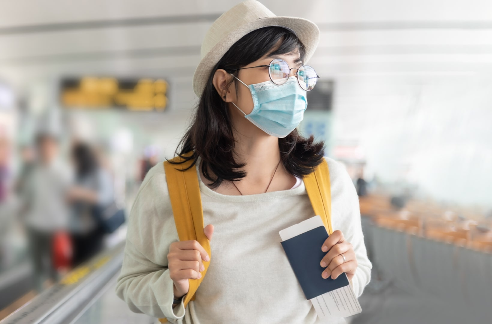
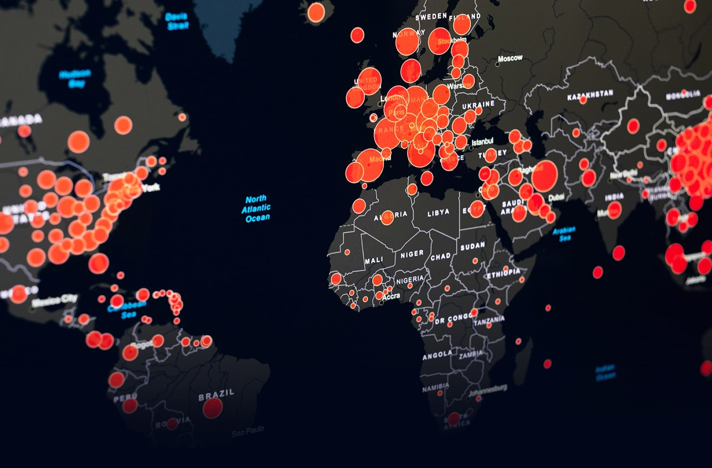
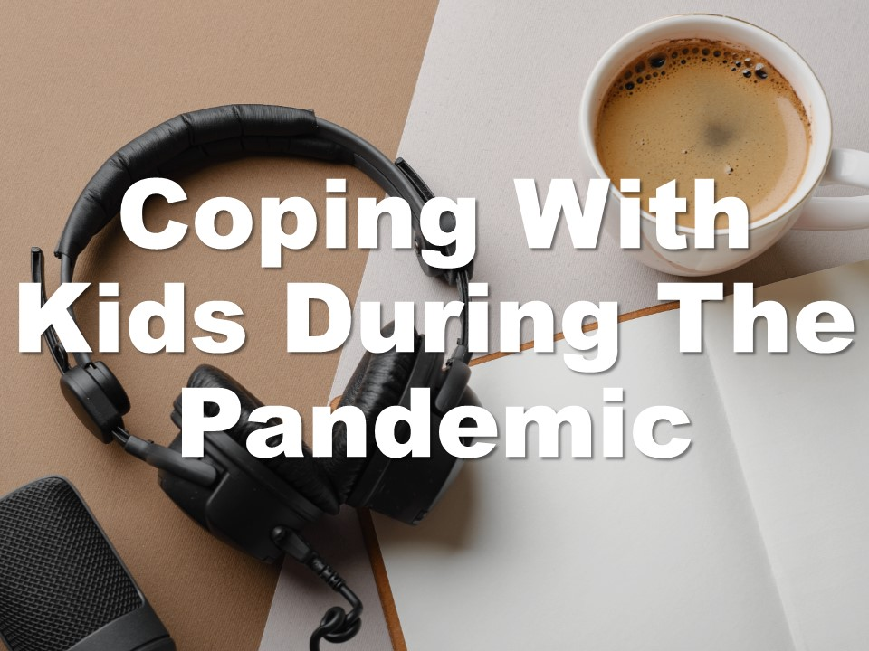
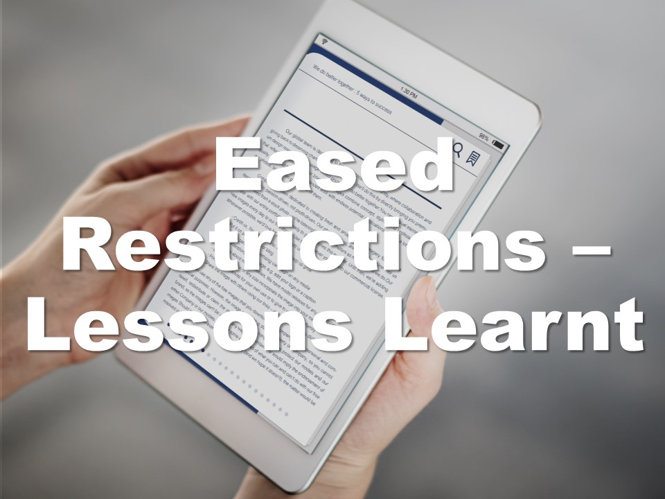

| **1-Minute Read** |
| :---------------: |
|                   |

As people around the world queue up for vaccine shots, some dream of finally being able to [attend football games](https://www.bloomberg.com/news/articles/2021-11-02/premier-league-soccer-crowds-pack-stadiums-like-never-before) or live music events, while others simply hope this means they can buy groceries safely. The approach towards easing stringent measure varies from country to country — while some opt for a gradual opening, others have lifted measures altogether.  

Gradual reopening and public health measures such as mandatory wearing of masks indoors, indoor capacity restrictions, social distancing, and implementing [vaccine passports](https://theconversation.com/vaccine-passports-why-they-are-good-for-society-160419) are some strategies that countries can adopt. Countries have also been reopening their borders for [international travel](https://www.instituteforgovernment.org.uk/explainers/covid-international-travel-rules) to cope with the economic and social impacts of the pandemic, that continue to become more [acute](https://www.iata.org/en/programs/covid-19-resources-guidelines/reopening-borders-documents/).

    
<b>What have some countries done to reduce restrictions?</b>

<a href="https://www.newsweek.com/sweden-norway-lifting-covid-restrictions-spark-reactions-pundits-want-end-mandates-1634916">Sweden, Norway, and Denmark</a> are among the countries that have decided to live with COVID-19. <a href="https://www.politico.eu/article/denmark-first-eu-lift-coronavirus-restrictions/">Denmark</a> was the first country in the European Union that lifted all COVID-19 restrictions. Norway said that “the time has come to return to a <a href="https://www.reuters.com/business/healthcare-pharmaceuticals/norway-end-coronavirus-related-restrictions-saturday-2021-09-24/">normal daily life</a>” and does not require proof of vaccination for citizens to enter nightclubs, bars or restaurants. <a href="https://www.aa.com.tr/en/europe/sweden-lifts-all-covid-19-restrictions/2378287">Sweden</a> also abolished all COVID-19 related restrictions, announcing that the pandemic has been brought under control. 

    
<b>What are the possible risks from having fewer restrictions?</b>

Optimistic projections estimate that by mid-2022, death and disease rates for COVID-19 may be <a href="https://www.straitstimes.com/singapore/covid-19-infection-and-death-rates-should-be-on-a-par-with-seasonal-flu-by-mid-2022-bill">lower than that of the seasonal common flu</a> owing to the increase in global immunity resulting from high vaccination rates of a population, or moderate vaccination levels coupled with significant prior COVID-19 infections. As a result, this has encouraged the lifting of COVID-19 restrictions in many countries across the globe.
 

Yet, the capacities of public health systems remain a concern for most governments, who resort to keeping a close watch on COVID-19 case numbers, ready to re-impose restrictions whenever deemed necessary. People and businesses are thus <a href="https://www.bmj.com/content/375/bmj-2021-067508">caught in confusion</a> when these policies are adjusted. 

 
Additionally, while there is a resumption of international activities as borders open up following vaccine rollouts, the lack of harmonised <a href="https://www.iata.org/en/iata-repository/pressroom/presentations/restarting-global-travel-agm2021/">border measures</a>, restrictions and procedures is a cause of confusion for travellers—who resort to finalising plans as late as possible to keep up <a href="https://www.swissinfo.ch/eng/travelers-are-waiting-till-last-minute-to-book-flights/47158012">with rapidly changing regulations</a>, incited by new virus strands. <a href="https://worldrepublicnews.com/as-international-travel-returns-confusion-reigns-over-vaccines/">Fragmented rules</a> about vaccine acceptance, documentation, as well as testing requirements are costly and difficult to navigate.

 
The return to normalcy is fragile. Countries that are reopening faster have reported a <a href="https://doi.org/10.1136/bmj-2021-067508">higher death toll</a> in the earlier stages of the pandemic. As individuals begin to integrate back into society — balancing their work and personal lives — the risks of cluster infections remain. <a href="https://www.fidh.org/en/issues/international-justice/covid-19-spreading-faster-than-vaccines-rich-countries-must-address">Vaccine inequality</a> also remains a concern, especially as it creates unvaccinated pockets where the virus can continue to mutate and spread. 

***Read on to find out if the costs of reducing COVID-19 restrictions are too high.***

    

    

    

    

	

