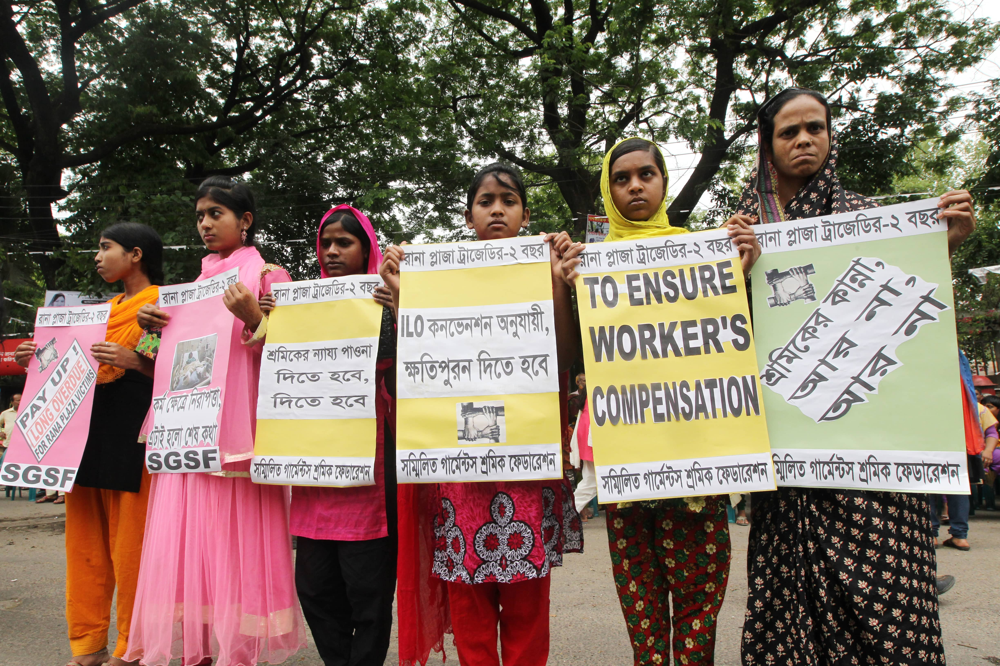
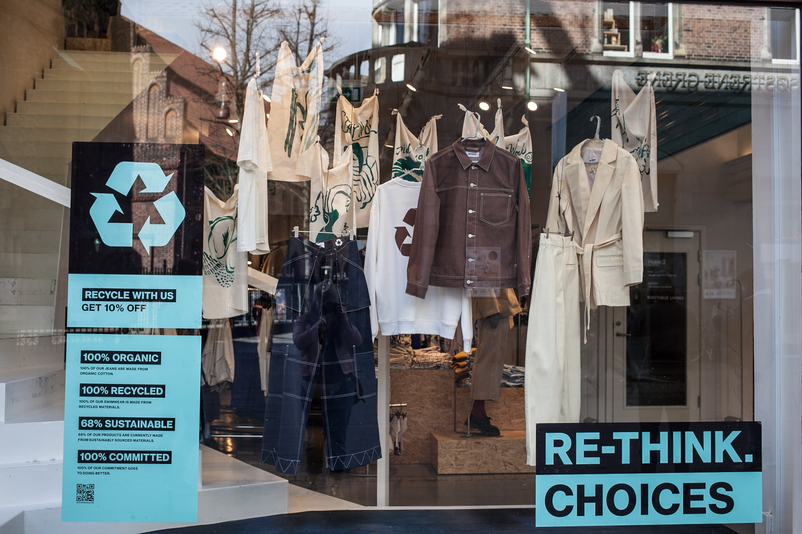

| **5-Minute Read** |
| :---------------: |
|                   |

**The Fast Fashion Crisis: Is There a Way Out?**

 

*From exploitative labour practices to environmental destruction, the fast fashion industry seems to be a giant red flag for our planet. Governments, businesses and consumers alike have started looking towards more ethical solutions to bridge the sustainability divide.*

 

***How have you tried to shop more sustainably when it comes to fashion?\*** 

 

The planet is spiraling into crisis mode due to our incessant need to update our wardrobes.

 

The fast fashion industry is responsible for [10% of global carbon emissions](https://www.unep.org/news-and-stories/press-release/un-alliance-sustainable-fashion-addresses-damage-fast-fashion) worldwide. Overconsumption and overproduction also mean that [92 million tonnes of textile waste](https://www.qut.edu.au/study/creative-industries/news?id=177289) are sent to landfills annually, while [93% of fashion brands](https://fashionchecker.org/) do not pay their workers a living wage.

 

Fast fashion has clearly brought the world to a tipping point, but is there a way out of this crisis?

 

**Fighting Back Against Fast Fashion**

 

The [2013 collapse of the Rana Plaza factory](https://theconversation.com/years-after-the-rana-plaza-tragedy-bangladeshs-garment-workers-are-still-bottom-of-the-pile-159224) building in Bangladesh which killed over 1000 garment workers brought to the forefront the disastrous consequences of the fast fashion economy. 

 

Governments around the world are responding by implementing legislations that will hold fashion brands accountable for unethical supply chain practices. For example, the German government is introducing a [‘due diligence’ law](https://www.just-style.com/news/germany-agrees-new-law-on-supply-chain-due-diligence/) that enforces legal penalties against German companies for labour abuses and a lack of compliance against environmental standards in their global supply chains.

                               

*Female garment workers demanding for compensation for the survivors of the Rana Plaza factory building collapse. The factory took only over 90 seconds to collapse, with unions referring to the event as a “mass industrial homicide.” [Shutterstock](https://www.shutterstock.com/zh-Hant/image-photo/young-labors-demanding-long-overdue-rana-1708455925).*

 

In the battle against fast fashion, non-governmental organisations (NGOs) also play a salient role in pushing for greater oversight and accountability from commercial juggernauts. 

 

The Hong Kong-based environmental NGO, [Redress](https://www.redress.com.hk/), uses public education campaigns and art installations to draw attention to broader issues in Asia’s fashion industry. They also work closely with industry partners, from designers and garment manufacturers to retailers, to drive change towards a more sustainable direction.

 

**Fashion Goes Green**

 

Consumers are increasingly calling out greenwashing practices from fashion brands and demanding them to take action for unsustainable production processes. According to the [South East Asia Fashion Sustainability Report 2021](https://issuu.com/fashionrevolution/docs/final___fashion_sustainability_report_2021), 80% of consumers in the region prefer to purchase from brands that are committed to social and environmental causes.

 

While the sustainable fashion movement is still in its infancy in Singapore, advocate Raye Padit agrees that local consumers are warming up to sustainable fashion options. As the founder of [The Fashion Pulpit](https://www.thefashionpulpit.com/), a Singapore-based clothes-swapping platform, Raye believes that clothes swapping can offer a viable solution to the waste generated by fast fashion.

 

“Swapping helps you extend the lifespan of your clothes. This means we can reduce on average 20% of textile waste, water usage, carbon emissions and land use per person. Swapping also lets you explore your personal style through ‘new-to-you’ garments, without generating more waste,” shares [Raye](https://zerrin.com/raye-padit-power-of-clothes-swapping-singapore/).

 

Raye’s journey in sustainable fashion started in 2013 when he realised that the fast fashion economy was producing at such a rapid rate that clothes were being thrown away as quickly as they were made. A budding fashion designer himself, Raye wanted to be “a part of the solution instead of the problem”.

 

 

 

*A store in Sweden, Stockholm, which produces clothes from recycled materials. [Shutterstock](https://www.shutterstock.com/zh-Hant/image-photo/sweden-stockholm-march-2019-storefront-clothes-1373121191).*

 

In 2021, Raye launched his own fashion line, [PeyaRework](https://www.instagram.com/peyarework/?hl=en), which repurposes some of the excess secondhand clothing that comes through The Fashion Pulpit into statement pieces. Their first collection was centered on upcycling jeans into a customisable denim vest that can be worn as a top, and each piece is made-to-order to minimise wastage.

 

“Fashion will not go away, but we can make it more responsible, ethical and sustainable,” says Raye.

 

**Giving Clothes a Second Life**

 

Combating the woes brought on by fast fashion giants might seem like a David meets Goliath situation, but consumers like you and me can create a huge impact by making more sustainable choices when it comes to our fashion purchases.

 

We spoke to Angelyn Tan, 21, who is doing just that by giving a second lease of life to clothes through her online vintage store. She visits a local warehouse once every two weeks to source for good-quality secondhand pieces which she sells via the Instagram handle, [@gma.vtg](https://www.instagram.com/gma.vtg/?hl=en).

 

What sparked Angelyn’s interest in secondhand clothes was her desire to find her own unique style. Vintage clothing seemed to offer her an alternative where she could break free from the homogeneity of fast fashion.

 

“Everyone buys fast fashion, so it’s hard to differentiate yourself from others,” she shares. “That’s why I decided to wear more vintage (pieces). First, it’s sustainable and second, it’s pretty affordable.”

 

Angelyn is not alone. According to a [survey](https://www.dbs.com/newsroom/Singaporeans_open_to_sustainable_fashion_but_wont_pay_more__DBS_survey) conducted by DBS, 7 in 10 Singaporeans are open to upcycling, recycling or swapping their clothes. The global secondhand market is also [projected to double](https://www.google.com/url?q=https://www.thredup.com/resale/%23resale-industry&sa=D&source=docs&ust=1644423339706684&usg=AOvVaw1ZZKlqR_vVkDJymgG0vND0) from 2021 to 2025, reaching a record-high of S$104 billion. In buying secondhand, consumers are not only extending the lifespans of their clothes, but they are also investing in quality pieces over mass production and variety.

 

 

*Shoppers browsing secondhand clothes at a thrift store. Credit:* [*RawPixel*](https://www.rawpixel.com/image/3887944/photo-image-face-mask-covid)

 

Despite the availability of options, it’s still hard for Angelyn to avoid purchasing items from fast fashion brands but she makes sure that each piece she buys is maximised in its utility. “I come up with a (visual) board to make sure that I can style it with the other pieces in my closet. I also like to chat with sellers, and ask about sizing and how the quality is so I don’t regret my purchases.”

 

Education and awareness can also help to bridge the gap and enable consumers to transition into making more sustainable choices when it comes to fashion. Angelyn shares, “It’s really just about questioning the choices when it comes to clothes. Do you really need that much clothing? How sure are you that these are not going to go out of trend? That’s what I think about when I buy clothes.” 

 

 

***How can the fashion industry be more sustainable and ethical with regards to its supply chain practices? What can you as a consumer in Singapore do to support the move towards sustainable fashion?\***

 

 

**Further Reading:**

- The Myth of Sustainable Fashion ([Harvard Busines Review](https://hbr.org/2022/01/the-myth-of-sustainable-fashion))

- The Moral Quandary of ‘Slow Fashion’ Influencers ([The New York Times](https://www.nytimes.com/2022/02/08/style/fashion-influencers-sustainability.html))

- The State of Size-Inclusive Sustainable Fashion ([Teen Vogue](https://www.teenvogue.com/story/state-of-size-inclusive-sustainable-fashion))

 