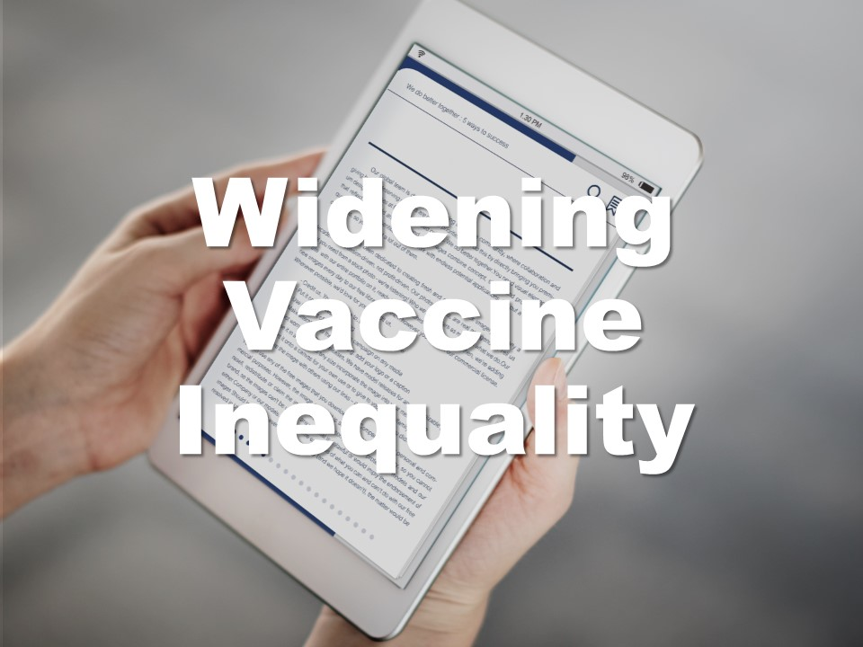
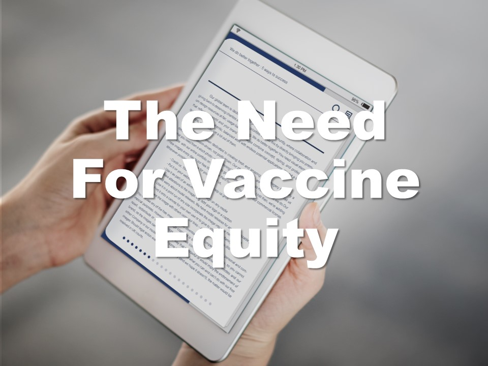

| **1-Minute Read** |
| :---------------: |
|                   |

Optimistic projections estimate that by mid-2022, death and disease rates for COVID-19 may be[ lower than that of the seasonal common flu](https://www.straitstimes.com/singapore/covid-19-infection-and-death-rates-should-be-on-a-par-with-seasonal-flu-by-mid-2022-bill) owing to the increase in global immunity resulting from high vaccination rates of a population, or moderate vaccination levels coupled with significant prior COVID-19 infections. As a result, this has encouraged the lifting of COVID-19 restrictions in many countries across the globe.  

 

Yet, the capacities of public health systems remain a concern for most governments, who resort to keeping a close watch on COVID-19 case numbers, ready to re-impose restrictions whenever deemed necessary. People and businesses are thus [caught in confusion](https://www.bmj.com/content/375/bmj-2021-067508) when these policies are adjusted. 

 

Additionally, while there is a resumption of international activities as borders open up following vaccine rollouts, the lack of harmonised [border measures](https://www.iata.org/en/iata-repository/pressroom/presentations/restarting-global-travel-agm2021/), restrictions and procedures is a cause of confusion for travellers—who resort to finalising plans as late as possible to keep up [with rapidly changing regulations](https://www.swissinfo.ch/eng/travelers-are-waiting-till-last-minute-to-book-flights/47158012), incited by new virus strands. [Fragmented rules](https://worldrepublicnews.com/as-international-travel-returns-confusion-reigns-over-vaccines/) about vaccine acceptance, documentation, as well as testing requirements are costly and difficult to navigate. 

 

The return to normalcy is fragile. Countries that are reopening faster have reported a [higher death toll](https://doi.org/10.1136/bmj-2021-067508) in the earlier stages of the pandemic. As individuals begin to integrate back into society — balancing their work and personal lives — the risks of cluster infections remain. [Vaccine inequality](https://www.fidh.org/en/issues/international-justice/covid-19-spreading-faster-than-vaccines-rich-countries-must-address) also remains a concern, especially as it creates unvaccinated pockets where the virus can continue to mutate and spread. 

Read on to learn more about the path forward. 

    

    

    

	

    

    

    

    

	

***Want to know more about the problems countries are facing?***

    

    

    

    

	

