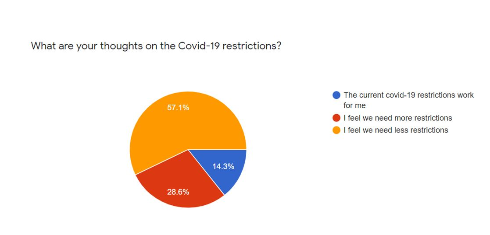

| **1-Minute Read** |
| :---------------: |
|                   |

Most countries have accepted that eradicating COVID-19 is [impossible](https://www.economist.com/briefing/2021/10/16/how-the-world-learns-to-live-with-covid-19). The emergence of new variants could impact how the pandemic continues to turn up. The Delta variant has shown that an elimination strategy is [no longer viable](https://www.cnbc.com/2021/10/05/zero-covid-strategies-abandoned-in-the-face-of-the-delta-variant.html). The highly transmissible Omicron variant has also posed challenges to easing COVID-19 measures, spurring [further border restrictions](https://www.japantimes.co.jp/news/2021/12/01/asia-pacific/china-covid-zero-omicron/) in some countries. 

As people find repeated lockdowns and strict quarantines draining, communities need to find a way to learn how to adapt and live with COVID-19 when the virus continues to persist.

 
History has shown that pandemics do eventually <a href="https://www.straitstimes.com/opinion/from-plague-to-polio-how-do-pandemics-end">end</a>; as sufficient numbers of people develop immunity, viruses cannot find new hosts to replicate in. Only one human disease, <a href="https://asm.org/Articles/2020/March/Disease-Eradication-What-Does-It-Take-to-Wipe-out">smallpox</a>, has ever been completely eradicated. Other diseases like influenza, measles, and cholera became endemic over time. These diseases were kept in check by vaccines and medical treatments.
 

Tightening and loosening restrictions have their own benefits and trade-offs. As countries explore solutions, academics encourage governments to <a href="https://www.sciencedirect.com/science/article/pii/S2666776221001988">collaborate and share available resources</a>. Better utilisation of tools to manage the pandemic, such as vaccinations, masks and ventilation might assist the world to get back on its feet as quickly and as safely as possible. 

As more countries transition to <a href="https://www.bmj.com/content/375/bmj-2021-067508">COVID-19 endemicity</a>, continuing efforts are required to address vaccine inequity, enhance health system capacities, and strengthen public health preparedness in view of potential emergent strains and waning vaccine immunities. 

    

    

	

	

Let's [hear from you](https://forms.gle/NFAYtAWQedbuSKxm8) about this Issue!

Take our [**poll**](https://forms.gle/zkBsk2izarbksiQB6) now, and share your views on this topic!  Here are the [current poll results](https://docs.google.com/forms/d/e/1FAIpQLSf_lZzfeQtbTtuAwcgXkhcuNBXjyWCb7ejOpZwelRO4lYboPg/viewanalytics): 

***Want to know more about how countries hope to move forward?***

    

    

    

    

	

