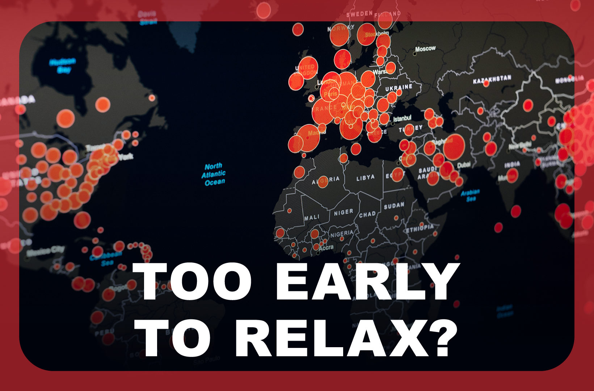

In our **Read to be SURE** **Conversations**, we will invite guests from all walks of life to share their expertise and perspectives on trending issues that matter. In line with one of NLB’s LAB25 key roles of nurturing an Informed Citizenry, we hope that the **Conversations** will help broaden and deepen your mindsets.  

## About this event

**This is a hybrid event. The programme will be live-streamed via ZOOM from library@harbourfront (25 pax max).**

**The existing Vaccination-Differentiated Safe Management Measures (VDS) apply to audience attending the event onsite.**

With the world affected by COVID-19 over the past 2 years, restrictions have become a constant part of our everyday lives. Tightening or relaxing the restrictions carry their own set of benefits and drawbacks, and this affects people in different ways. In this Read to be SURE Conversations event, our guests will share different perspectives on this issue.

 

Read to be SURE (RTBS) is part of NLB’s Libraries and Archives Blueprint 2025 (LAB25), a five-year journey of our next phase of transformation. RTBS aims to educate and inform the public on trending topics through a combination of curated reading content and accompanying programmes. By exploring multiple perspectives on these topics, readers and participants will benefit from a balanced and credible knowledge base.

 

Speakers:

- Dr Cherie Chan, Clinical Psychologist at Thrive Family
- Ong Quanda, Founder and CEO at Gnome & Bow
- Noor Soeb, World traveller at @twotravellingaunties

 

Moderator:

- Sean Tan, Director (Outreach) of Debate Association (Singapore)

 

**About the Speakers and Moderator**

**Dr Cherie Chan** is a clinical psychologist at Thrive Family. She is registered with the Singapore Register of Psychologist (SRP) and is an SRP approved clinical supervisor. With nearly a decade of experience in public and private mental health settings across Singapore and Australia, Cherie has worked extensively with adolescents and adults presenting with a range of psychological issues. She is the current President of the Singapore Psychological Society and holds various roles in the international psychology scene including being the Secretary for the Asia Pacific Psychology Alliance (APPA), and represents psychologists in Singapore as a member of the ASEAN Regional Union of Psychological Societies (ARUPS).

**-----**

**Quanda Ong** is the founder and CEO at Gnome & Bow, renowned for its unique bags and wallet designs inspired by storybook classics. Over the years, Quanda has grown his brand’s presence to 9 countries and over 40 point-of-sales internationally. He was awarded as Finalist for Designer of the Year (Accessories) in 2017 and has successfully launched numerous collaborative collections with global corporations such as American Express, Tiger Beer and Knight Frank.

**-----**

**Noor Soeb** (Norah) is one half of the duo, 2TravellingAunties who travelled to 3 continents, 27 countries in 2 years from 2019 till 2021. Norah chose the road less trodden, driving and living in a motorhome through Europe, United Kingdom, North Africa and Turkey, while smashing stereotypes with every mile on the clock. 5 lockdowns, multiple PCR tests and denied entries at borders despite having the second most powerful passport in the world, Norah is planning and preparing her next road adventure.

**-----**

**Sean Tan** is the Outreach Director at Debate Association (Singapore) and a second year student at Singapore Polytechnic. Sean has represented his school in debating tournaments around the world and adjudicated at local tournaments, including the Singapore Secondary Schools Debating Championship and NYP's Inter-school Tournament. Since joining DA(S), Sean has worked on several projects including Youth Debate Open and December Debate Camp. In school, Sean is the President of the Singapore Polytechnic Debating Club, conducting weekly trainings for aspiring debaters.

Return to the 5 Perspectives:

    

    

    

    

