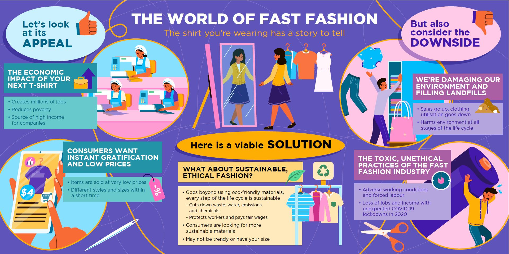
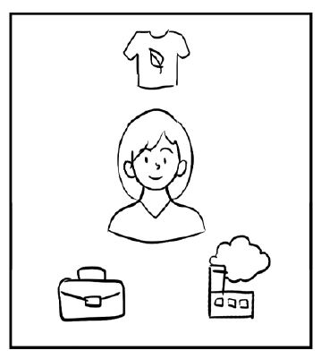

# **Curious about the fashion industry?**

It’s the weekend and you’ve got some time and money. You browse your favourite clothing store but find nothing you like. No worries, you’ll come back again next week. Chances are you’ll find new styles on the shelves.

Pretty normal, right?

That didn’t use to be the case.

Before, you would have to wait [until next season](https://www.forbes.com/sites/theyec/2019/05/13/three-reasons-why-fast-fashion-is-becoming-a-problem-and-what-to-do-about-it/?sh=3934b17c144b) to find new items. There is a demand for readily available, trend-driven fashion, thanks to the world’s [growing middle class](https://www.mckinsey.com/~/media/mckinsey/industries/retail/our insights/the state of fashion 2020 navigating uncertainty/the-state-of-fashion-2020-final.pdf) and their higher disposable income. Now, fashion companies are capitalising on fast fashion, the rapid production of trendy and cheap clothes in high volumes. 

# **Is fast fashion worth the while?**

To do so, we have to delve deeper into the perspectives of fast fashion…

|                                                           |                                                              |                                                           |                                                         |                                           |
| --------------------------------------------------------- | ------------------------------------------------------------ | --------------------------------------------------------- | ------------------------------------------------------- | ----------------------------------------- |
| The economic and  social benefits are almost unbelievable | Instant  gratification, low prices, a win-win situation for consumers | We’re damaging our environment  and filling our landfills | The toxic, unethical  practices of the fashion industry | What about  sustainable, ethical fashion? |

 

  **1.**    **The economic and social benefits are almost unbelievable**     The clothing manufacturing industry employs many  and creates millions of jobs. You buying your next T-shirt could  feed households and reduce poverty in many countries in the Asia-Pacific  (APAC) region, also known as “the clothing factory of the world”. In 2019, [65   million people](https://www.ilo.org/wcmsp5/groups/public/---asia/---ro-bangkok/documents/briefingnote/wcms_758626.pdf) worked in the [APAC   clothing manufacturing industry](https://www.ilo.org/wcmsp5/groups/public/---ed_dialogue/---sector/documents/publication/wcms_669355.pdf) – that’s  every seven out of 10 people of all workers worldwide.     Fast fashion makes a lot of money for  trend-driven fashion companies. It’s almost a vicious cycle as the  more [clothes   are released](https://www.vox.com/the-goods/22573682/shein-future-of-fast-fashion-explained), the more consumers [want   to buy](https://www.npr.org/2013/03/11/174013774/in-trendy-world-of-fast-fashion-styles-arent-made-to-last). No wonder the industry is key to the economic and social  development of many developing countries.     

 

  **2.**    **Instant gratification, low prices, a win-win situation for consumers**     Consumers love the instant gratification fast  fashion provides. Getting their hands on [the   latest fashion trends](https://www.drapersonline.com/news/how-the-desire-for-instant-gratification-is-shaping-retail) within a short time seems too good to be true. Yet  this is what the industry delivers, and at affordable prices to boot. Throughout the years, clothing prices have gone as [low   as S$3 to S$15](https://www.channelnewsasia.com/cnainsider/true-cost-demand-cheap-clothes-fast-fashion-industry-environment-220706) in Singapore. That’s almost as cheap as your daily  lunch or dinner. Keep in mind fast fashion companies  have also been producing items in [a   wide range of sizes](https://ww.fashionnetwork.com/news/Mango-completes-violeta-integration-shein-tops-plus-size-inclusivity-list,1327389.html) to cater to different  body shapes.     Fast fashion continues to grow to keep up  with rising demand and rapidly changing fashion trends. One has to stop and  wonder, what are the drawbacks?     

 

  **3.**     **We’re damaging our environment and  filling our landfills**     As clothing sales go up, clothing utilisation  goes down. How many clothing items do you buy and get rid of within a year? A  survey involving 1,000 Singaporeans revealed that we buy 34 pieces of new  clothing on average and dispose of 27 items within 12 months. For almost  every item we buy, we throw away another.     How many times do you wear a shirt before  throwing it away? In the survey, clothes were only worn seven to 10 times  before being thrown out. [Landfills   are being filled](https://emf.thirdlight.com/link/2axvc7eob8zx-za4ule/@/download/1) with textile waste,  generated through [this   throw-away culture](https://www.channelnewsasia.com/singapore/bursting-seams-singapores-cast-clothing-1035441).      From the production of raw materials to the  disposal of clothes, the fast fashion industry consumes large amounts of  chemicals, water and energy. It is a source of pollution for both air and  water, accounting for [10%   of all global carbon emissions](https://www.europarl.europa.eu/RegData/etudes/BRIE/2019/633143/EPRS_BRI(2019)633143_EN.pdf). That’s  more than the international flights industry and the maritime shipping  industry combined.     

 

  **4.**    **The toxic, unethical practices of the fashion industry**     Remember the great economic impact we  mentioned earlier? While that may be true, the industry has long been plagued  by low wages, modern slavery, child labour and poor working conditions.     Factory workers in developing countries often  work extremely long hours in harsh and dangerous conditions with a severe  lack of occupational safety and health measures. Over  a thousand workers were killed and another 2,500 plus were injured on 24  April 2013 upon the collapse of [Bangladesh’s   Rana Plaza building](https://theconversation.com/years-after-the-rana-plaza-tragedy-bangladeshs-garment-workers-are-still-bottom-of-the-pile-159224), which housed five  garment factories.     That’s not even including the unethical  business practices. During the COVID-19 lockdowns in 2020, many high street  fashion retailers simply cancelled their orders as shops were closed and  consumers stayed at home. Almost overnight, thousands  of people [lost   their jobs](https://www.independent.co.uk/news/world/asia/h-m-garment-workers-factory-india-jobs-a9579856.html) and their source of income.     But it’s not all bleak in the world of fast  fashion. Consumers are becoming more aware of the harm behind their clothing  purchases. As such, [fashion   companies](https://www.vox.com/the-goods/2021/7/19/22535050/gen-z-relationship-fast-fashion) are beginning to implement [more   sustainable initiatives](https://www.npr.org/2019/07/27/745418569/can-fast-fashion-and-sustainability-be-stitched-together).     

 

  **5.**     **What about sustainable, ethical  fashion?**     Let’s say you come back to the same store a  week later. Immediately, some clothes nearby catch your eye. You spot the tag  and are taken aback by the high price. When you look closer, you spot it — a  sticker labelled, “Sustainable Fashion”.     [Sustainability   goes beyond](http://changingmarkets.org/wp-content/uploads/2021/07/SyntheticsAnonymous_FinalWeb.pdf) switching  to natural materials and labelling clothes as “eco-friendly”. Sustainable fashion uses materials that are  responsibly and ethically sourced or have a lower environmental impact. The  idea focuses on all aspects of the entire supply chain, production and life cycle.  Companies have to [manage   their waste and water](https://www.forbes.com/sites/stephanrabimov/2020/07/20/post-pandemic-fashion-will-be-sustainable-and-affordable-interview-with-anna-gedda-head-of-sustainability-at-hm-group/), limit their gas  emissions and chemicals, [protect   their workers](https://www.greenstrategy.se/sustainable-fashion/what-is-sustainable-fashion/) and pay them fairly.     This is why sustainable fashion may not be  trendy or affordable. Sustainable clothing tend to [be   more expensive](https://www.channelnewsasia.com/cnainsider/true-cost-demand-cheap-clothes-fast-fashion-industry-environment-220706) due to their small batch  production and extensive manufacturing processes. Some consumers are  more likely to [pay premium   prices](https://www.thegoodtrade.com/features/what-is-slow-fashion) for [sustainable   alternatives](https://www.vogue.co.uk/fashion/article/sustainable-fashion-affordable). There is also a lack of size diversity in  sustainable fashion, with consumers [facing   difficulty](https://fashionjournal.com.au/fashion/the-sustainable-fashion-industry-is-size-exclusive-take-it-from-this-model/) in finding sustainable clothing  [that   fits them](https://www.harpersbazaar.com/fashion/designers/a32213676/plus-size-sustainable-fashion/).       Finally, you decide to buy a sustainable  shirt from your favourite brand. On the way home, you suddenly spot headlines  of the very same brand being exposed for child labour. Weren’t they supposed  to be ‘sustainable’? Research might be required as some companies use  misleading marketing tactics and false sustainability claims to get you to  buy their products.      

 

# **Curious about the fashion industry?**

Here are some materials to further your learning.

## ITS APPEAL

### Articles

1.    [How fast fashion became a multi-trillion-dollar industry](https://www.businessofbusiness.com/articles/examining-fast-fashions-appeal-and-issues/)

2.    [Brand addiction in the contexts of luxury and fast-fashion brands](https://e-tarjome.com/storage/panel/fileuploads/2020-05-06/1588762187_E14818-e-tarjome.pdf)

3.    [Fast fashion is getting faster and that’s a good thing](https://www.themanufacturer.com/articles/fast-fashion-getting-faster-thats-good-thing/)

## ITS DOWNSIDES

### Articles

1.    [‘A monstrous disposable industry’: Facts about fast fashion](https://unearthed.greenpeace.org/2019/09/12/fast-facts-about-fast-fashion/)

 2.    [Following a t-shirt from cotton field to landfill shows the true cost of fast fashion](https://theconversation.com/following-a-t-shirt-from-cotton-field-to-landfill-shows-the-true-cost-of-fast-fashion-127363)

 3.    [Textile workers in developing countries and the European fashion industry](https://www.europarl.europa.eu/RegData/etudes/BRIE/2020/652025/EPRS_BRI(2020)652025_EN.pdf)

###  Podcasts

1.    [Fulfilling our fast fashion fix](https://www.npr.org/2021/08/03/1024284959/fulfilling-our-fast-fashion-fix)

2.    [Weekly economics podcast: Fast fashion](https://neweconomics.org/2021/08/weekly-economics-podcast-fast-fashion) 

### Video

[Our love for cheap clothes: What’s the true cost?](https://www.youtube.com/watch?app=desktop&v=n75jVQTUEE8)

## SUSTAINABLE FASHION

### Articles

1.    [The top benefits of sustainable clothing](https://www.goodwear.com/blogs/news/the-top-benefits-of-sustainable-clothing)

 2.    [Fast fashion’s waste model is going out of style](https://www.politico.eu/article/fast-fashion-waste-losing-appeal-greta-thunberg-environment/)

 3.    [Synthetic anonymous: Fashion brand’s addiction to fossil fuels](http://changingmarkets.org/wp-content/uploads/2021/07/SyntheticsAnonymous_FinalWeb.pdfhttp:/changingmarkets.org/wp-content/uploads/2021/07/SyntheticsAnonymous_FinalWeb.pdf)

 4.    [The problem with ‘sustainable fashion’](https://edition.cnn.com/style/article/the-problem-with-sustainable-fashion/index.html)

 5.    [More consumers want sustainable fashion, but are brands delivering it?](https://www.forbes.com/sites/andriacheng/2019/10/17/more-consumers-want-sustainable-fashion-but-are-brands-delivering-it/?sh=2126650734a5) 

### Video

1.    [How fast fashion adds to the world’s clothing waste problem](https://www.youtube.com/watch?app=desktop&v=elU32XNj8PM)