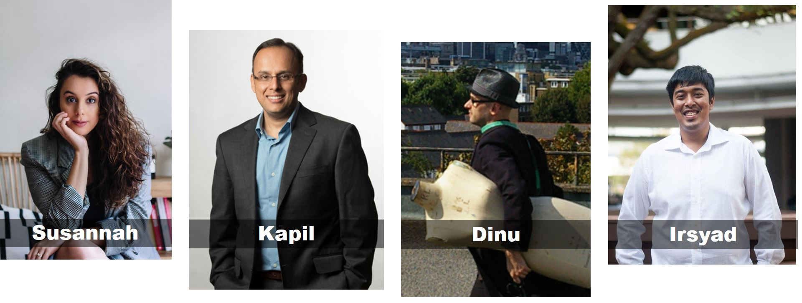

In our ***Read to be SURE*** **Conversations**, we will invite guests from all walks of life to share their expertise and perspectives with a balanced view on trending issues that matter. In line with one of NLB’s LAB25 key roles of nurturing an Informed Citizenry, we hope that the **Conversations** will help broaden and deepen your mindsets.  

With cheap prices and easy access to various outlets, fast fashion has grown exponentially over the years as consumers flock to them for their apparel needs. Is fast fashion necessarily bad? Is sustainable fashion the only solution? Join us on 8 Dec, as the speakers share their views on this issue. 

**About this Event**

**This is a hybrid event. The programme will be live-streamed via ZOOM from Library@Orchard.**

**The existing COVID-19 Safety Management Measures apply to audience attending the event onsite.**

Please register **[HERE](https://www.eventbrite.sg/e/fast-fashion-love-it-or-hate-it-read-to-be-sure-tickets-202741323757)**. 

**Speakers:**

- Susannah Jaffer, Founder and CEO, ZERRIN
- Dr. Kapil R. Tuli, Professor of Marketing and Director of the Retail Centre of Excellence, SMU
- Corneliu Dinu Tudor Bodiciu, Programme Leader for BA Fashion Design and Textile and BA Fashion Media and Industries, LASALLE College of the Arts

**Moderator:**

- Irsyad Ramthan, Product Manager, X0PA AI

   

**About the Speakers and Moderator**:

**Susannah Jaffer** is the founder & CEO at ZERRIN, Asia's curated destination for creative, conscious brands. A Singapore-based global marketplace and media channel, ZERRIN connects you with the best in independent, D2C brands and content to inspire your green journey. She has spoken on the topic of sustainability in fashion/beauty/retail for companies like Coty, Great Eastern, Fashion Revolution and General Assembly. The platform has also been featured in notable outlets like The Straits Times, Her World, Channel News Asia and Vogue.

**Dr. Kapil R. Tuli** is the Professor of Marketing and Director of the Retail Centre of Excellence at the Lee Kong Chian School of Business (LKCSB), Singapore Management University. Over the years, Dr. Tuli has published several papers in leading marketing journals, Journal of Marketing, Journal of Marketing Research, and Management Science. In 2017, Dr. Tuli received the 2017 Sheth Foundation/Journal of Marketing Award for his paper “Rethinking Customer Solutions: From Product Bundles to Relational Processes” that was published in the 2007 edition of the Journal of Marketing.

**Corneliu Dinu Tudor Bodiciu** is the Programme Leader for BA Fashion Design and Textile and BA Fashion Media and Industries at LASALLE College of the Arts. Romanian-born and London-trained, he received his Master’s degree in Fashion Design and Technology at London College of Fashion where he is currently pursuing a doctoral research degree. His designs challenge the way we think about the relationship between the human body and clothing. His work has been showcased in established fashion magazines, such as Vogue, Vision China, Bazaar Asia, Elle and L’Officiel Ukraine, and worn by Lady Gaga, Viktoria Modesta and Chicks on Speed or featured in movies like the Hunger Games: Mockingjay 1 & 2 or the Foundation series.

**Irsyad Ramthan** is the former co-Founder of Interseed, a digital platform that promotes sustainability solutions and supports various start-ups that utilize alternative sustainable materials for different consumer products. Over the years, he has designed innovation programmes for Southeast Asian under-35s to solve sustainability challenges. He is currently a product manager by profession, and is a seasonal host for Interseed’s podcast titled *Impact in Sight*.  

 Here's a visual map of the different perspectives in this issue of *Read to be SURE*:

