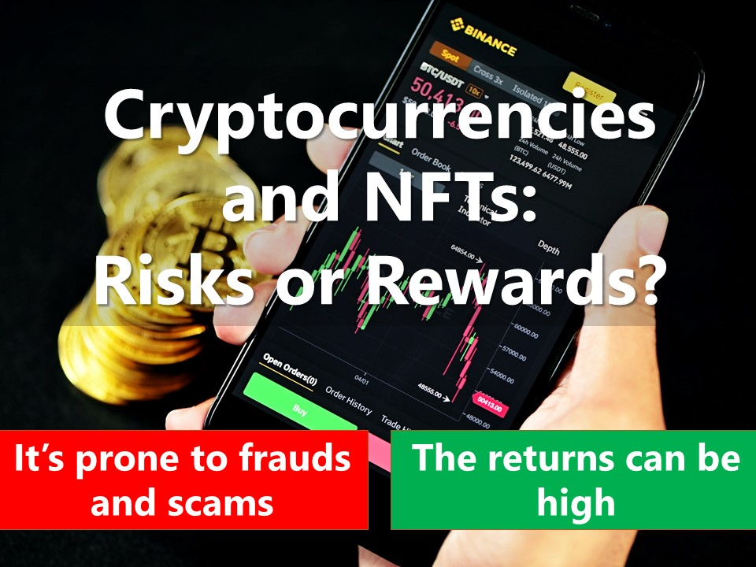

<table style="width: 180%;" border="0" cellpadding="50">
	<tbody>
   <tr>
    <th>NO, IT'S STILL RISKY AND PRONE TO FRAUDS AND SCAMS</th>
    <th>YES, THERE ARE SOME SUCCESS STORIES IN SINGAPORE</th>
  </tr>
        <tr>
            <td>In enim justo, rhoncus ut, imperdiet a, venenatis vitae, justo. Nullam dictum felis eu pede mollis pretium. Integer tincidunt. Cras dapibus. Vivamus elementum semper nisi. Aenean vulputate eleifend tellus. Aenean leo ligula, porttitor eu, consequat vitae, eleifend ac, enim. Aliquam lorem ante, dapibus in, viverra quis, feugiat a, tellus.

<b>Keep on reading at <a href="https://vulcanpost.com/661378/onecoin-singapore-cryptocurrency-fraud/">VulcanPost</a></b>
</td>
            <td>Lorem ipsum dolor sit amet, consectetuer adipiscing elit. Aenean commodo ligula eget dolor. Aenean massa. Cum sociis natoque penatibus et magnis dis parturient montes, nascetur ridiculus mus. Donec quam felis, ultricies nec, pellentesque eu, pretium quis, sem. Nulla consequat massa quis enim. Donec pede justo, fringilla vel, aliquet nec, vulputate eget, arcu

<b>Keep on reading at <a href="https://www.straitstimes.com/life/arts/spore-project-makes-14-million-debut-with-nft-trading-cards">The Straits Times</a></b>
</td>
        </tr>
		<tr>
			<td><b>Learn more about the downsides here:</b> 
                <a href="https://www.moneysense.gov.sg/articles/2018/10/risks-of-cryptocurrencies-initial-coin-offerings-and-other-digital-tokens">Risks of cryptocurrencies, initial coin offerings and other digital tokens</a> &nbsp; 
                                <a href="https://www.channelnewsasia.com/singapore/nft-not-suitable-retail-investors-consumers-caution-tharman-mas-2500276?cid=internal_sharetool_androidphone_16022022_cna">NFTs not suitable for retail investors, consumers should exercise 'extreme caution': Tharman</a>
                </td>
			<td><b>Learn more about the upsides here:</b> 
                <a href="https://www.aljazeera.com/economy/2021/11/2/singapore-wants-to-be-a-crypto-hub-or-risk-being-left-behind">Singapore says embrace crypto or risk being ‘left behind’</a> &nbsp; 
                <a href="https://www.businesstimes.com.sg/banking-finance/there-is-a-place-for-crypto-in-singapore-if-regulated-tharman">There is a place for crypto in Singapore if regulated: Tharman</a>
               </td>
		</tr>
	</tbody>
</table>

### Take our **[poll](https://forms.gle/jPRLHNv5DXGgKtrEA)** now!

