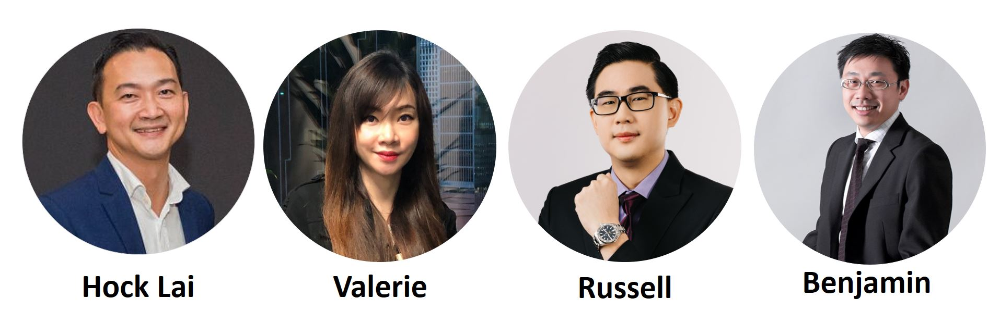

In our **Read to be SURE** **Conversations**, we will invite guests from all wal	ks of life to share their expertise and perspectives on trending issues that matter. In line withg one of NLB’s LAB25 key roles of nurturing an Informed Citizenry, we hope that the **Conversations** will help broaden and deepen your mindsets.  

Date: Sat, 26 Mar 2022 
Time: 3pm-4.30pm

## About this event

**This is a hybrid event. The programme will be live-streamed via ZOOM from the National Library (25 pax max).**

**The existing Vaccination-Differentiated Safe Management Measures (VDS) apply to audience attending the event onsite.**

In this Read to be SURE Conversations event, our guests will share different perspectives on this issue.

 

Read to be SURE (RTBS) is part of NLB’s Libraries and Archives Blueprint 2025 (LAB25), a five-year journey of our next phase of transformation. RTBS aims to educate and inform the public on trending topics through a combination of curated reading content and accompanying programmes. By exploring multiple perspectives on these topics, readers and participants will benefit from a balanced and credible knowledge base.

Speakers:

- **Chia Hock Lai** - Co-founder, Global Fintech Institute, and Co-chair Blockchain Association SG
- **Valerie Chai** - Director, Hyrule Advisory Pte Ltd

Moderator:

- **Nizam Ismail** - Founder/CEO, Ethikom Consultancy

