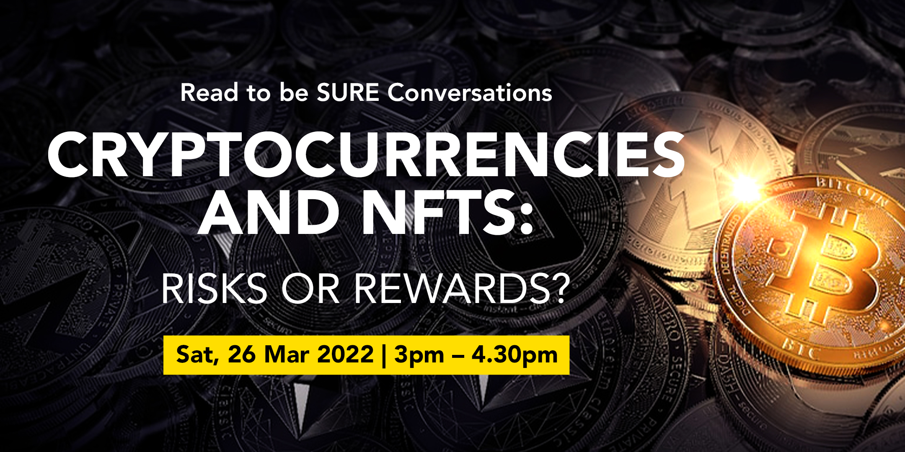

In our **Read to be SURE** **Conversations**, we will invite guests from all walks of life to share their expertise and perspectives on trending issues that matter. In line with one of NLB’s LAB25 key roles of nurturing an Informed Citizenry, we hope that the **Conversations** will help broaden and deepen your mindsets.  

## About this event

**This is a hybrid event. The programme will be live-streamed via ZOOM from The National Library Building.** 

**The existing Vaccination-Differentiated Safe Management Measures (VDS) apply to audience attending the event onsite and is limited to a maximum of 25 attendees.** 

With the surge in popularity and investments in cryptocurrencies and NFTs over the past year, it gave rise to their fair share of opportunities and risks, with reports of massive returns as well as scams. In this Read to be SURE Conversations event, our guests will share about the different perspectives on this topic. 

 

Read to be SURE (RTBS) is part of NLB’s Libraries and Archives Blueprint 2025 (LAB25), a five-year journey of our next phase of transformation. RTBS aims to educate and inform the public on trending topics through a combination of curated reading content and accompanying programmes. By exploring multiple perspectives on these topics, readers and participants will benefit from a balanced and credible knowledge base.

 

**Speakers:**

- **Chia Hock Lai** - Co-founder, Global Fintech Institute, and Co-chair Blockchain Association SG
- **Valerie Chai** - Director, Hyrule Advisory Pte Ltd
- **Russell Yee** – Assistant Vice President, OCBC Bank

**Moderator:** 

- **Nizam Ismail** – Founder/CEO, Ethikom Consultancy

 

 
<b>About the Speakers and Moderator</b>

    
<b>Chia Hock Lai</b> is the co-founder of the Global Fintech Institute, CEO of Switchnovate and Senior Blockchain Advisor of Tembusu Partners. He has two decades of experience in the financial and technology industries, having worked in Singapore’s GovTech and NTUC Income. An alumnus of NUS and NTU, he is the co-chairman of the Blockchain Association Singapore, and former & founding president of Singapore Fintech Association. He is a council member of and strategic advisor to numerous tech start-ups and organizations such as Bondevalue, RootAnt Global, RegTank, Morpheus Labs and IEEE Blockchain and Distributed Ledger Standard Committee. In addition, he is also an Institute of Banking and Finance (IBF) Fellow for digital transformation and a Fintech Fellow at the the Singapore University of Social Science (SUSS).
    

    
<b>Valerie Chai</b> is currently the director and lead consultant with Hyrule Advisory. She is responsible for fundraising deal structure and advisory as well as information technology ecosystem design for her clients. She has more than 10 years of experience in providing corporate finance and digital transformation training. Her current consulting projects consists of transformation to Web 3.0, such as machine learning, crypto social tokens and NFTs. She graduated as a scholar with First Class Honours, Dean List, C.H. Wee Gold Medal from Nanyang Business School, she moved on to complete her post-graduate with High Honours for Advanced Valuation in New York University Stern Business School. She is also certified in Machine learning for Business Application in Massachusetts Institute of Technology.

    
<b>Russell Yee</b> is a compliance officer who takes a keen interest in the financial and fintech sector, particularly in the cryptocurrency space. He recognises the potential that crypto has to disrupt the traditional financial businesses and has taught himself the ins and outs of crypto by dabbling in the space since 2017. He views crypto from both the wealth management and regulatory compliance lens, and adopts a pragmatic and risk-based approach when evaluating the latest crypto trends.
 
    
    
<b>Nizam Ismail</b> is CEO and Founder of Ethikom Consultancy, a Southeast Asian focused consultancy. He works with financial institutions, Fintech firms and blockchain enterprises on a variety of regulatory compliance matters. His career experience spanned from being a Deputy Public Prosecutor/State Counsel at the Commercial Affairs Department, a Division Head at the Monetary Authority of Singapore, Head of Compliance for Southeast Asia at Morgan Stanley and Lehman Brothers, and former head of financial services of a law firm. He is a Fellow at the Singapore University of Social Sciences and Head of the Regulatory and Compliance Sub-Committee of the Blockchain Association of Singapore. 

