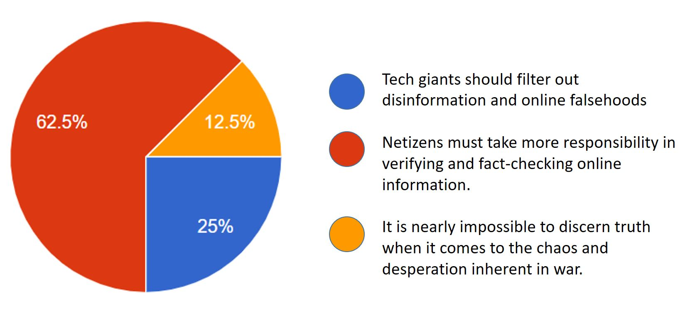

*A special edition of the Read to be SURE – this issue presents two and more viewpoints on current events and issues to broaden your perspectives and mindsets*

Photo by Sima Ghaffarzadeh from Pexels

| **TECH GIANTS SHOULD DO MORE TO TACKLE DISINFORMATION**      | **WE SHOULD BE MORE DISCERNING AND SELF-RELIANT**            |
| ------------------------------------------------------------ | ------------------------------------------------------------ |
| The Prime Ministers of Poland, Lithuania, Latvia and Estonia urged the CEOs of Google, YouTube, Facebook and Twitter to proactively suspend accounts denying, glorifying or justifying wars of aggression, war crimes and crimes against humanity. | There is a limit to what social media companies can do. They sometimes face the demands of an authoritarian government that pressures them to censor content it doesn’t like, and to allow propaganda to run unchecked. |
| **Read more at [CNA](https://www.channelnewsasia.com/business/google-facebook-twitter-must-combat-ukraine-fake-news-polish-baltic-leaders-2526116)** | **Read more at [VOX](https://www.vox.com/2022/2/26/22951757/russia-facebook-twitter-youtube-censorship-social-media)** |
|                                                              |                                                              |
| **To know more about what tech giants have done about fake news:** | **To know more about fact-checking misleading information:**  |
| [Facebook, Twitter remove disinformation accounts targeting Ukrainians](https://www.nbcnews.com/tech/internet/facebook-twitter-remove-disinformation-accounts-targeting-ukrainians-rcna17880) | [Ukraine and beyond: How to fact check misleading videos](https://fullfact.org/blog/2022/feb/how-to-fact-check-ukraine-videos/) |
| [Twitter, Facebook clamp down on Russia state-linked news](https://www.channelnewsasia.com/business/twitter-facebook-clamp-down-russia-state-linked-news-2527366) | [Fact-checking fake videos of Ukraine conflict](https://edition.cnn.com/2022/02/26/politics/fake-ukraine-videos-fact-check) |
| [Facebook takes down Ukraine disinformation network and bans Russian-backed media](https://www.theguardian.com/technology/2022/feb/28/facebook-takes-down-disinformation-network-targeting-ukraine-meta-instagram) | [Fact check roundup: What's true and what's false about the Russian invasion of Ukraine](https://www.usatoday.com/story/news/factcheck/2022/02/28/fact-check-whats-true-and-whats-false-invasion-ukraine/6952717001/) |
| [Douyin takes down more than 3,500 videos about war in Ukraine](https://www.asiaone.com/digital/douyin-takes-down-more-3500-videos-about-war-ukraine) | [The Sift (28 Feb 2022): Ukraine news tips](https://newslit.org/educators/sift/the-sift-ukraine-news-tips-russian-disinfo-machine-george-washington-fact-checker/) |

##### Who should help us filter the truth about the Russia-Ukraine conflict?  Take our **[poll](https://forms.gle/K2K2HTdPnrVQY2AV8)** now!

