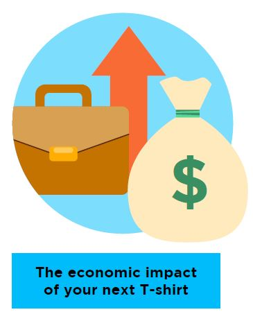

# **1.**    **The economic and social benefits are almost unbelievable**     

The clothing manufacturing industry employs many  and creates millions of jobs. You buying your next T-shirt could  feed households and reduce poverty in many countries in the Asia-Pacific  (APAC) region, also known as “the clothing factory of the world”. In 2019, [65   million people](https://www.ilo.org/wcmsp5/groups/public/---asia/---ro-bangkok/documents/briefingnote/wcms_758626.pdf) worked in the [APAC   clothing manufacturing industry](https://www.ilo.org/wcmsp5/groups/public/---ed_dialogue/---sector/documents/publication/wcms_669355.pdf) – that’s  every seven out of 10 people of all workers worldwide.     Fast fashion makes a lot of money for  trend-driven fashion companies. It’s almost a vicious cycle as the  more [clothes   are released](https://www.vox.com/the-goods/22573682/shein-future-of-fast-fashion-explained), the more consumers [want   to buy](https://www.npr.org/2013/03/11/174013774/in-trendy-world-of-fast-fashion-styles-arent-made-to-last). No wonder the industry is key to the economic and social  development of many developing countries.    

 

