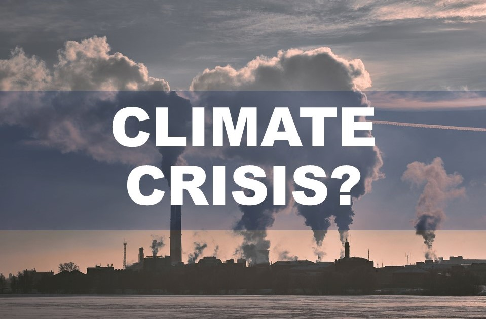

| **1-Minute Read** |
| :---------------: |
|                   |

***2. Price Factor***

Photo by Dollar Gill on Unsplash  

Consumers love the instant gratification fast fashion provides. Getting their hands on [the latest fashion trends](https://www.drapersonline.com/news/how-the-desire-for-instant-gratification-is-shaping-retail) within a short time seems too good to be true. Yet this is what the industry delivers, and at affordable prices to boot. Fast fashion is everywhere and is produced at very low cost. Fast fashion companies have also been producing items in [a wide range of sizes](https://ww.fashionnetwork.com/news/Mango-completes-violeta-integration-shein-tops-plus-size-inclusivity-list,1327389.html) to cater to different body shapes.

This industry continues to grow to keep up with rising demand and rapidly changing fashion trends. One has to stop and wonder: What are the drawbacks?

    

    

	

***Still  Curious About The Appeal of the Fast Fashion Industry?***

We have more information for you:

**ARTICLES** 1.    [How fast fashion became a multi-trillion-dollar industry](https://www.businessofbusiness.com/articles/examining-fast-fashions-appeal-and-issues/)  2.    [Brand addiction in the contexts of luxury and fast-fashion brands](https://e-tarjome.com/storage/panel/fileuploads/2020-05-06/1588762187_E14818-e-tarjome.pdf)  3.    [Fast fashion is getting faster and that’s a good thing](https://www.themanufacturer.com/articles/fast-fashion-getting-faster-thats-good-thing/)

