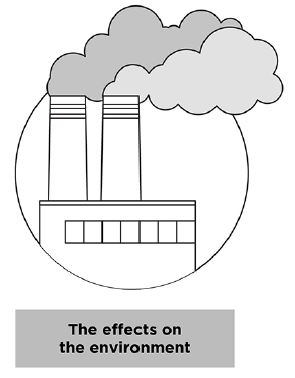

## 3. We’re Damaging Our Environment And  Filling Our Landfills     

As clothing sales go up, clothing utilisation goes down. How many clothing items do you buy and get rid of within a year? [A survey](https://www.channelnewsasia.com/singapore/bursting-seams-singapores-cast-clothing-1035441) involving 1,000 Singaporeans revealed that we buy 34 pieces of new clothing on average and dispose of 27 items within 12 months. For almost every item we buy, we throw away another.

How many times do you wear a shirt before throwing it away? Clothes were only worn seven to 10 times before being thrown out. [Landfills are being filled](https://emf.thirdlight.com/link/2axvc7eob8zx-za4ule/@/download/1) with textile waste, generated through [this throw-away culture](https://www.channelnewsasia.com/singapore/bursting-seams-singapores-cast-clothing-1035441). 

From the production of raw materials to the disposal of clothes, the fast fashion industry consumes large amounts of chemicals, water and energy. It is a source of pollution for both air and water, accounting for [10% of all global carbon emissions](https://www.europarl.europa.eu/RegData/etudes/BRIE/2019/633143/EPRS_BRI(2019)633143_EN.pdf). That’s more than the international flights industry and the maritime shipping industry combined.