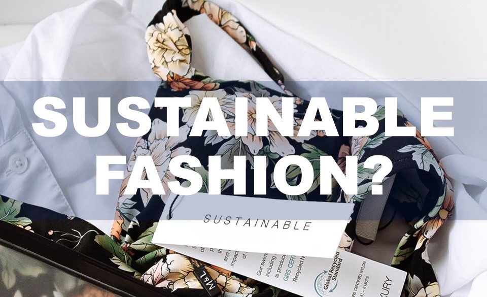

| **1-Minute Read** |
| :---------------: |
|                   |

***3. Environmental Impact***

Photo by Maxim Tolchinskiy on Unsplash

As clothing sales go up, clothes end up not being worn or are thrown away easily. How many clothing items do you buy and get rid of within a year? [A survey](https://www.channelnewsasia.com/singapore/bursting-seams-singapores-cast-clothing-1035441) involving 1,000 Singaporeans revealed that we buy 34 pieces of new clothing on average and dispose of 27 items within 12 months. For almost every item we buy, we throw away another.

How many times do you wear a shirt before throwing it away? Clothes were only worn seven to 10 times before being thrown out. [Landfills are being filled](https://emf.thirdlight.com/link/2axvc7eob8zx-za4ule/@/download/1) with textile waste, generated through this [throw-away culture](https://www.channelnewsasia.com/singapore/bursting-seams-singapores-cast-clothing-1035441). 

From the production of raw materials to the disposal of clothes, the fast fashion industry consumes large amounts of chemicals, water and energy. It is a source of pollution for both air and water, accounting for [10% of all global carbon emissions](https://www.europarl.europa.eu/RegData/etudes/BRIE/2019/633143/EPRS_BRI(2019)633143_EN.pdf). That’s more than that of the international flights industry and the maritime shipping industry combined.

    

    

	

***Still  Curious About The Downsides of the Fast Fashion Industry?***

We have more information for you:

**VIDEO** 

<iframe width="560" height="315" src="https://www.youtube.com/embed/n75jVQTUEE8" title="YouTube video player" frameborder="0" allow="accelerometer; autoplay; clipboard-write; encrypted-media; gyroscope; picture-in-picture" allowfullscreen></iframe>

**PODCASTS** 
1. [Fulfilling our fast fashion fix](https://www.npr.org/2021/08/03/1024284959/fulfilling-our-fast-fashion-fix) 

2. [Weekly economics podcast: Fast fashion](https://neweconomics.org/2021/08/weekly-economics-podcast-fast-fashion)  

**ARTICLES** 

 1.    [‘A monstrous disposable industry’: Facts about fast fashion](https://unearthed.greenpeace.org/2019/09/12/fast-facts-about-fast-fashion/)   2.    [Following a t-shirt from cotton field to landfill shows the true cost of fast fashion](https://theconversation.com/following-a-t-shirt-from-cotton-field-to-landfill-shows-the-true-cost-of-fast-fashion-127363)   3.    [Textile workers in developing countries and the European fashion industry](https://www.europarl.europa.eu/RegData/etudes/BRIE/2020/652025/EPRS_BRI(2020)652025_EN.pdf) 