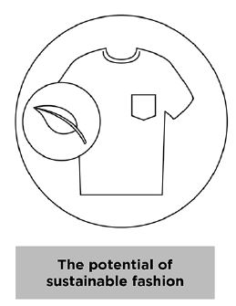

**5.**     **What about sustainable, ethical  fashion?**     

Let’s say you come back to the same store a  week later. Immediately, some clothes nearby catch your eye. You spot the tag  and are taken aback by the high price. When you look closer, you spot it — a  sticker labelled, “Sustainable Fashion”.     [Sustainability   goes beyond](http://changingmarkets.org/wp-content/uploads/2021/07/SyntheticsAnonymous_FinalWeb.pdf) switching  to natural materials and labelling clothes as “eco-friendly”. Sustainable fashion uses materials that are  responsibly and ethically sourced or have a lower environmental impact. The  idea focuses on all aspects of the entire supply chain, production and life cycle.  Companies have to [manage   their waste and water](https://www.forbes.com/sites/stephanrabimov/2020/07/20/post-pandemic-fashion-will-be-sustainable-and-affordable-interview-with-anna-gedda-head-of-sustainability-at-hm-group/), limit their gas  emissions and chemicals, [protect   their workers](https://www.greenstrategy.se/sustainable-fashion/what-is-sustainable-fashion/) and pay them fairly.     This is why sustainable fashion may not be  trendy or affordable. Sustainable clothing tend to [be   more expensive](https://www.channelnewsasia.com/cnainsider/true-cost-demand-cheap-clothes-fast-fashion-industry-environment-220706) due to their small batch  production and extensive manufacturing processes. Some consumers are  more likely to [pay premium   prices](https://www.thegoodtrade.com/features/what-is-slow-fashion) for [sustainable   alternatives](https://www.vogue.co.uk/fashion/article/sustainable-fashion-affordable). There is also a lack of size diversity in  sustainable fashion, with consumers [facing   difficulty](https://fashionjournal.com.au/fashion/the-sustainable-fashion-industry-is-size-exclusive-take-it-from-this-model/) in finding sustainable clothing  [that   fits them](https://www.harpersbazaar.com/fashion/designers/a32213676/plus-size-sustainable-fashion/).       Finally, you decide to buy a sustainable  shirt from your favourite brand. On the way home, you suddenly spot headlines  of the very same brand being exposed for child labour. Weren’t they supposed  to be ‘sustainable’? Research might be required as some companies use  misleading marketing tactics and false sustainability claims to get you to  buy their products.      

  