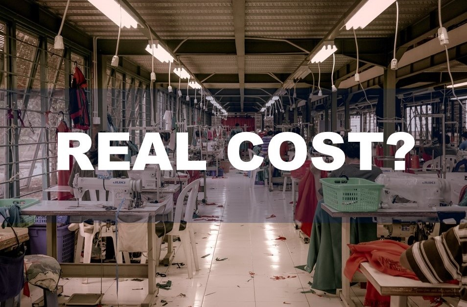

| **2-Minute Read** |
| :---------------: |
|                   |

***5. Sustainable Fashion*** 

Photo by Jess @ Harper Sunday on Unsplash  

Let’s say you come back to the same store a week later. Immediately, some clothes nearby catch your eye. You spot the tag and are taken aback by the high price. When you look closer, you spot it — a sticker labelled “Sustainable Fashion”.

[Sustainability goes beyond](http://changingmarkets.org/wp-content/uploads/2021/07/SyntheticsAnonymous_FinalWeb.pdf) switching to natural materials and labelling clothes as “eco-friendly”. Sustainable fashion uses materials that are responsibly and ethically sourced or have a lower environmental impact. The idea focuses on all aspects of the entire supply chain, production and life cycle. Companies have to [manage their waste and water](https://www.forbes.com/sites/stephanrabimov/2020/07/20/post-pandemic-fashion-will-be-sustainable-and-affordable-interview-with-anna-gedda-head-of-sustainability-at-hm-group/), limit their gas emissions and chemicals, [protect their workers](https://www.greenstrategy.se/sustainable-fashion/what-is-sustainable-fashion/) and pay them fairly.

This is why sustainable fashion may not be trendy or affordable. Sustainable clothing tend to [be more expensive](https://www.channelnewsasia.com/cnainsider/true-cost-demand-cheap-clothes-fast-fashion-industry-environment-220706) due to their small batch production and extensive manufacturing processes. Some consumers are more likely to [pay premium prices](https://www.thegoodtrade.com/features/what-is-slow-fashion) for [sustainable alternatives](https://www.vogue.co.uk/fashion/article/sustainable-fashion-affordable). There is also a lack of size diversity in sustainable fashion, with consumers [facing difficulty](https://fashionjournal.com.au/fashion/the-sustainable-fashion-industry-is-size-exclusive-take-it-from-this-model/) in finding sustainable clothing [that fits them](https://www.harpersbazaar.com/fashion/designers/a32213676/plus-size-sustainable-fashion/). 

Finally, you decide to buy a sustainable shirt from your favourite brand. On the way home, you suddenly spot headlines of the very same brand being exposed for child labour. Weren’t they supposed to be ‘sustainable’? Research might be required as some companies use [misleading marketing tactics and false sustainability claims](http://changingmarkets.org/wp-content/uploads/2021/07/SyntheticsAnonymous_FinalWeb.pdf) to get you to buy their products. 

    

    

	

***Still  Curious About The Sustainable Fashion Industry?***

We have more information for you:

 **VIDEO**

<iframe width="560" height="315" src="https://www.youtube.com/embed/elU32XNj8PM" title="YouTube video player" frameborder="0" allow="accelerometer; autoplay; clipboard-write; encrypted-media; gyroscope; picture-in-picture" allowfullscreen></iframe>

 **ARTICLES** 1.    [The top benefits of sustainable clothing](https://www.goodwear.com/blogs/news/the-top-benefits-of-sustainable-clothing)   2.    [Fast fashion’s waste model is going out of style](https://www.politico.eu/article/fast-fashion-waste-losing-appeal-greta-thunberg-environment/)   3.    [Synthetic anonymous: Fashion brand’s addiction to fossil fuels](http://changingmarkets.org/wp-content/uploads/2021/07/SyntheticsAnonymous_FinalWeb.pdfhttp:/changingmarkets.org/wp-content/uploads/2021/07/SyntheticsAnonymous_FinalWeb.pdf)   4.    [The problem with ‘sustainable fashion’](https://edition.cnn.com/style/article/the-problem-with-sustainable-fashion/index.html)   5.    [More consumers want sustainable fashion, but are brands delivering it?](https://www.forbes.com/sites/andriacheng/2019/10/17/more-consumers-want-sustainable-fashion-but-are-brands-delivering-it/?sh=2126650734a5)  