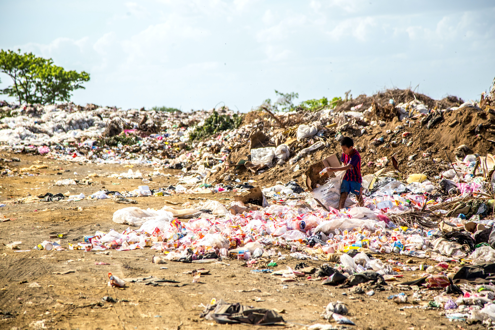

### ***The Downsides***

*Photo by [Hermes Rivera](https://unsplash.com/@hermez777?utm_source=unsplash&utm_medium=referral&utm_content=creditCopyText) on [Unsplash](https://unsplash.com/s/photos/dump-clothes?utm_source=unsplash&utm_medium=referral&utm_content=creditCopyText)*  

|      | ARTICLES  1.    [‘A monstrous disposable industry’: Facts about fast fashion](https://unearthed.greenpeace.org/2019/09/12/fast-facts-about-fast-fashion/)   2.    [Following a t-shirt from cotton field to landfill shows the true cost of fast fashion](https://theconversation.com/following-a-t-shirt-from-cotton-field-to-landfill-shows-the-true-cost-of-fast-fashion-127363)   3.    [Textile workers in developing countries and the European fashion industry](https://www.europarl.europa.eu/RegData/etudes/BRIE/2020/652025/EPRS_BRI(2020)652025_EN.pdf)  PODCASTS  1.    [Fulfilling our fast fashion fix](https://www.npr.org/2021/08/03/1024284959/fulfilling-our-fast-fashion-fix)  2.    [Weekly economics podcast: Fast fashion](https://neweconomics.org/2021/08/weekly-economics-podcast-fast-fashion)   VIDEO  [Our love for cheap clothes: What’s the true cost?](https://www.youtube.com/watch?app=desktop&v=n75jVQTUEE8) |
| ---- | ------------------------------------------------------------ |
|      |                                                              |

