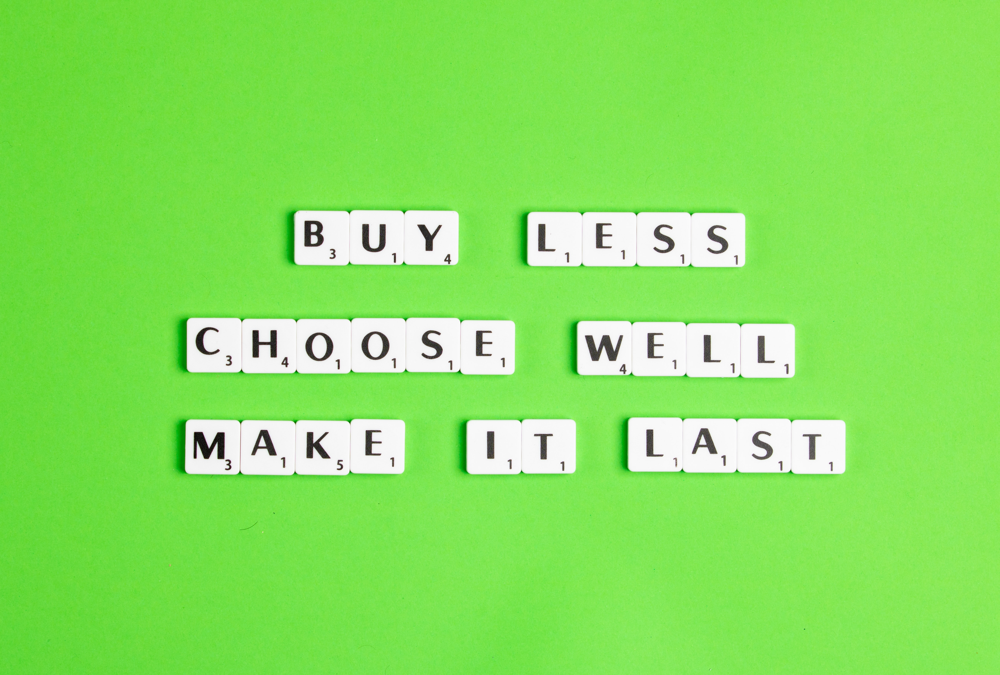

### ***Sustainable Fashion***

*Photo by [Edward Howell](https://unsplash.com/@edwardhowellphotography?utm_source=unsplash&utm_medium=referral&utm_content=creditCopyText) on [Unsplash](https://unsplash.com/s/photos/slow-fashion?utm_source=unsplash&utm_medium=referral&utm_content=creditCopyText)*  

|      | ARTICLES  1.    [The top benefits of sustainable clothing](https://www.goodwear.com/blogs/news/the-top-benefits-of-sustainable-clothing)   2.    [Fast fashion’s waste model is going out of style](https://www.politico.eu/article/fast-fashion-waste-losing-appeal-greta-thunberg-environment/)   3.    [Synthetic anonymous: Fashion brand’s addiction to fossil fuels](http://changingmarkets.org/wp-content/uploads/2021/07/SyntheticsAnonymous_FinalWeb.pdfhttp:/changingmarkets.org/wp-content/uploads/2021/07/SyntheticsAnonymous_FinalWeb.pdf)   4.    [The problem with ‘sustainable fashion’](https://edition.cnn.com/style/article/the-problem-with-sustainable-fashion/index.html)   5.    [More consumers want sustainable fashion, but are brands delivering it?](https://www.forbes.com/sites/andriacheng/2019/10/17/more-consumers-want-sustainable-fashion-but-are-brands-delivering-it/?sh=2126650734a5)    VIDEO  1.    [How fast fashion adds to the world’s clothing waste problem](https://www.youtube.com/watch?app=desktop&v=elU32XNj8PM) |
| ---- | ------------------------------------------------------------ |
|      |                                                              |

