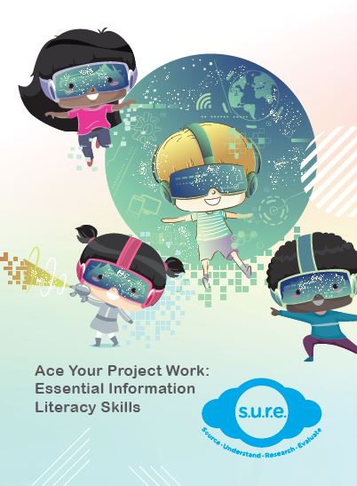

**ACE YOUR PROJECT WORK**

Ace Your Project Work is a resource for primary school teachers to help their students improve on project work skills. Lesson plans and worksheets based on the S.U.R.E (Source, Understand, Research and Evaluate) steps are enclosed within the resource for teachers to refer to.

### SOCIAL STUDIES**

#### **Cultural Diversity** 

Learn more about different cultures in the resources below. 

[Know Your Festival: Hari Raya Puasa](/infographic/1_Hari Raya Infographic 2020.pdf)

[Know Your Festival: Deepavali](/infographic/2_Deepavali Infographic 2020.pdf)

[Know Your Festival: Christmas](/infographic/3_Christmas Infographic 2020.pdf)

[Singapore Costumes](/infographic/UPDATED19 Singapore Costumes.pdf)

[Harmony in Diversity: Interfaith Dialogue and Integration Efforts](/cheatsheet/NLB_Cheatsheet_Harmony_in_diversity_Jul2019.pdf) 

#### **Understanding Singapore** 

These resources give more information on Singapore’s buildings, environment and surroundings. 

[Greek and Roman Architecture in Singapore Civic District](/cheatsheet/Cheat-sheet-Architecture-lowres (1).pdf)

[Housing in Singapore](/infographic/BigPicture_Housing-in-Singapore.pdf) 

[Living in Kampongs](/infographic/BigPicture_KampongLife_FINAL-publish-Aug2017.pdf) 

[Environmental Champions](/cheatsheet/Cheatsheet2_Environment.pdf) 

[Climate Change Effects and Low Carbon Future](/cheatsheet/NLB_Cheatsheet_11_ClimateChange.pdf )

[Reducing Waste and Managing the Problem](/cheatsheet/NLB_Cheatsheet_Reducing_Waste_Jul2019.pdf) 

[Water in Singapore](/cheatsheet/NLB_Cheatsheet_WaterinSingapore_Jul2019.pdf) 

[Liveable Cities](/cheatsheet/NLB_Cheatsheet_Liveable_Cities_Jul2019.pdf) 

[Traffic Congestion](/cheatsheet/NLB_Cheatsheet_Traffic_Congestion_Jul2019.pdf) 

[A Car-lite Future: Reducing Car Usage in Singapore](/cheatsheet/NLB_Cheatsheet_Carlite_Jul2019.pdf) 

[Islands of Singapore](/cheatsheet/NLB_Cheatsheet_IslandsofSingapore_Jul2019.pdf) 

[Smart Nation Initiatives in Singapore](/cheatsheet/NLB_Cheatsheet_Smart_Nation_Initiatives_Jul2019.pdf) 

[Weather and Climate](/cheatsheet/NLB_Cheatsheet_WeatherandClimate_Jul2019.pdf) 

#### **Singapore’s Past** 

Find out more about the history of Singapore through these resources. 

[Singapore Street Names](/infographic/UPDATED19 Singapore street names.pdf) 

[Gambling](/infographic/BigPicture-theme04-Gambling_FINAL-publish.pdf)

[Street Hawkers](/infographic/BigPicture-theme01-Street-Hawkers_FINAL-publish-Aug2017.pdf) 

#### **Appreciating the World** 

These resources provide information on various topics about the world. 

[Ancient Inventions](/cheatsheet/NLB_Cheatsheet_Ancient_Inventions_Jul2019.pdf) 

[The Value of History and the Past](/cheatsheet/NLB_Cheatsheet_Values of History and the Past_Jul2019.pdf) 

[Different Types of Hotels Around the World](/cheatsheet/NLB_Cheatsheet_Hotels_Jul2019.pdf) 

[Inventions in the 21st Century](/cheatsheet/NLB_CHEATSHEET_21stInventions.pdf) 

[Types of Houses Around the World](/cheatsheet/Cheatsheet_house_Final_lowres.pdf) 

[Migration](/cheatsheet/NLB_Cheatsheet_Migration_Jul2019.pdf) 

[Digital Economy and the 4th Industrial Revolution](/cheatsheet/NLB_Cheatsheet_Digital_Economy_Jul2019.pdf) 

#### **About Southeast Asia** 

Find out some interesting facts about Southeast Asia in these resources. 

[Ancient Kingdoms in Southeast Asia](/cheatsheet/NLB_Cheatsheet_SEAKingdom_Jul2019.pdf) 

[Southeast Asia: People and Places](/cheatsheet/NLB_Cheatsheet_SEA_People_and_Places_Jul2019.pdf) 

[Capteh](/cheatsheet/Cheatsheet_capteh_lowres.pdf) 

### **RESEARCH SKILLS**

#### **Information Resources** 

If you’re not sure where to go to find sources to research for your homework, here is some information that you can refer to. 

#### NewspaperSG

	<iframe class="resp-iframe" src="https://www.youtube.com/embed/3l38zzEptq0" gesture="media" allow="encrypted-media" allowfullscreen></iframe>

#### NLB eResources & Setting Up MyLibrary ID

	<iframe class="resp-iframe" src="https://www.youtube.com/embed/3MsUaXed7Gg" gesture="media" allow="encrypted-media" allowfullscreen></iframe>

#### Singapore Infopedia

	<iframe class="resp-iframe" src="https://www.youtube.com/embed/TfSNrJttMk4" gesture="media" allow="encrypted-media" allowfullscreen></iframe>

#### Archives Online

	<iframe class="resp-iframe" src="https://www.youtube.com/embed/27xY2ZuG57o" gesture="media" allow="encrypted-media" allowfullscreen></iframe>

[Social Studies: Issues Investigation Made Easy](/infographic/NLB_Infographic_SocialStudies.pdf)

####  Searching Skills

The information available on the Internet can be overwhelming. Here are some ways to make your search for information more effective. 

[Google Search Tips](/infographic/NLB_Infographic_GoogleSearchTips.pdf)

[Research Strategy: Information Chaining](/infographic/NLB_Infographic_InformationChaining.pdf)

[Smart Searching Saves Precious Time](/infographic/NILP-inforgraphics-search-save-time-lowres.pdf) 

[Six Steps to Success](/infographic/NLB_6Steps_LR.pdf) 

[Be Search Smart](/infographic/NLB-search-smart_A2_LR.pdf)

#### Determining the Reliability of Information

Not all information on the internet can be trusted. You can refer to the information below and determine if your information is reliable. 

[Deconstructing media messages](/infographic/Infographics6_FA-Low-Res.pdf)

[Facts versus opinion](/infographic/FactsVsOpinionInfoG1505.pdf)

[Analysing Visuals](/cheatsheet/Cheat-sheet-9-Visual-text-analysis-0812.pdf) 

[Inferential Skills](/cheatsheet/cheat-sheet-11-inferential-skils.pdf) 

[Reading Critically](/infographic\ReadingInfoGFA.pdf) 

[Logical Fallacies](/infographic/LogicalFallaciesInfoG5FA (1).pdf) 

[5W1H Questioning Technique](/infographic/5W1H Questioning Technique.pdf)

[Be SURE About Your Research](/infographic/Be-SURE_Infographic_Hires.pdf) 

[The power of the click and tell](/infographic/NILP-inforgraphics-lowres.pdf)

[Identifying Professionals from the Imposters](/infographic/Identify Professionals.pdf) 

[Reading Critically](/infographic/ReadingInfoGFA.pdf) 

#### SURE Lok Hom & the Case of Antique Chairs

	<iframe class="resp-iframe" src="https://www.youtube.com/embed/idBVtJ9s7F4" gesture="media" allow="encrypted-media" allowfullscreen></iframe>

#### Report Writing Skills 

If you need help with writing your report after finding all the necessary information, refer to the resources below. 

[How to Paraphrase](/infographic/Infographic-how-to-paraphrase.pdf)

[How to Avoid Plagiarism](/infographic/NLB_infographic_AvoidPlagiarism.pdf)

[Citations](/infographic/Cheatsheet_Citation_25nov_.pdf) 

[How to Take Notes in Class](/infographic/take-notes-lowres.pdf) 

[How to Do a Literature Review](/infographic/LiteratureReviewInfoG11FA.pdf) 

#### Staying Safe Online 

Not everybody surfing the internet has good intentions. Look through the resources below to find out how you can stay safe online. 

[Privacy and You](/infographic/NLB_Infographic_PrivacyandYou.pdf)

[Be vigilant against online predators](/infographic/NLB_Infographic_BeVigilant.pdf)

[To tweet or not to tweet?](/infographic/NLB-inforgraphics-tweet.pdf)

[Street Smart on Social Media](/infographic/Infographic-8.pdf) 

### **SURE-vivor** 

Check out the resources curated by our Librarians at:

[http://www.nlb.gov.sg/discovereads/can-you-sure-vive/](http://www.nlb.gov.sg/discovereads/can-you-sure-vive/){:target="_blank"}