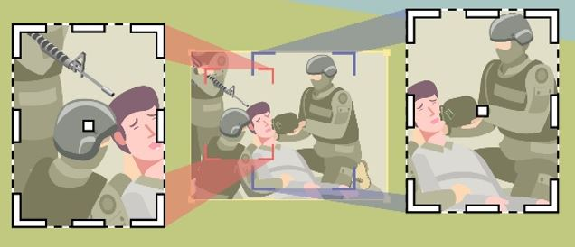
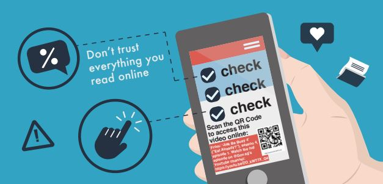

## **Combating Fake News**

These sources will help you discern the reliability of the information that you’re reading. 

**[How to be S.U.R.E. of your COVID-19 Information](//blog/seniors/SN0021)**

[**Watch out for manipulated content**](/blog/fake-news/fn0006)

#### [**How to be S.U.R.E. before you share**](/blog/fake-news/fn0001)

Learn how to safeguard yourself and others against online falsehoods by using the National Library Board's S.U.R.E. steps. 

This video is also available in other languages:

- [Mandarin version](/blog/seniors/SN0022)
- [Malay version](/blog/seniors/SN0023)
- [Tamil version](/blog/seniors/SN0024)

**[Evaluating Images](/blog/information-literacy/IL00003)**

We encounter many images daily – through messaging apps, on social media or various information sources. However, these pictures might not always provide us with the full story. The photographs may be taken from particular angles to convey certain messages, and may have very well been cropped or altered to serve certain agendas. Hence, it is important for us to evaluate images we come across to ascertain if they are credible.  

[**Fact-Checking Using Multiple Sources**](/infographic/Multiple-Sources-English_revised.pdf)

If you receive any dubious information, you can check the facts using credible sources before you share.

​	

[**How To Deal With Dubious Messages**](/blog/seniors/sn0005)

Bogus stories can be easily spread through SMS and social messaging tools and apps. Before you share, verify the information using the steps in this tip sheet. 

**[如何查证可疑信息](/blog/seniors/sn0014)**

虚假信息能够轻易地通过手机简讯、社交平台的私讯工具，以及应用软件散播开来。在点击“分享”之前，请先利用这张提示表里的步骤查证信息的可靠性。

**[Langkah-Langkah Untuk Menghalang Penyebaran Mesej Meragukan](/blog/seniors/sn0015)**

Cerita palsu mudah disebarkan menerusi khidmat pesanan ringkas (SMS), alat dan aplikasi sebaran mesej sosial. Pastikan anda menyemak informasi dengan menggunakan tip-tip  berikut.

[**சந்தேகமான செய்திகளைக் கையாள்வது எப்படி**](/blog/seniors/sn0016)

குறுஞ்செய்தி, சமூக ஊடகச்செயலிகள் போன்றவற்றின்மூலம் பொய்யான கதைகள் எளிதில் பரப்பப்படலாம். பகிர்வதற்ககு முன், இந்த வழிகளின் மூலம் தகவல்களைச் சரி பாருங்கள்.

**[How seniors can fight fake news](/blog/seniors/sn0017)**

Don’t believe everything you read online. Find out how you can verify dubious information in this tip sheet.    

[**乐龄人士如何参与打击不实信息**](/blog/seniors/sn0018)

不要盲目地相信你在网上接触到的信息，请利用这张提示表来了解如何验证可疑信息。  

**[Langkah-langkah untuk warga emas membasmi berita palsu](/blog/seniors/sn0019)**

Jangan mudah mempercayai semua yang baca di dalam talian. Pastikan anda menyemak informasi dengan menggunakan tip-tip berikut.

[**மூத்தவர்கள் பொய்யான செய்திகளை எப்படி எதிர்க்கலாம்?**](/blog/seniors/sn0020)

இணையத்தில் வாசிக்கும் அனைத்தையும் நம்பிவிடாதீர்கள்.   சந்தேகமான தகவல்களை எப்படிச் சரி பார்க்கலாம் என இந்த குறிப்புத்தாளில் இருந்து தெரிந்து கொள்ளுங்கள். 

[**How to Spot Doctored Photographs**](/infographic/Infographics7_FA-Low-Res.pdf)

With cameras in our smartphones, it is easy to snap away and take pictures of anything at anytime. However, we can also find image editing apps in our phones to enhance and beautify the image. These edited images may not seem to harm anyone. But unknowingly, doctored images can influence our behaviour and alter our past memories. Download the full infographic to learn how to detect doctored images.

**[How Do You Identify a Hoax Website](/infographic/Infographics5_FA-Low-Res.pdf)**

​	In the world on vast information on the Internet, it is important to be sure that the website you are reading is not harbouring any false information. Download the full infographic to learn how the 4 ways of S.U.R.E. is applied to identify if a website is a hoax or not.

