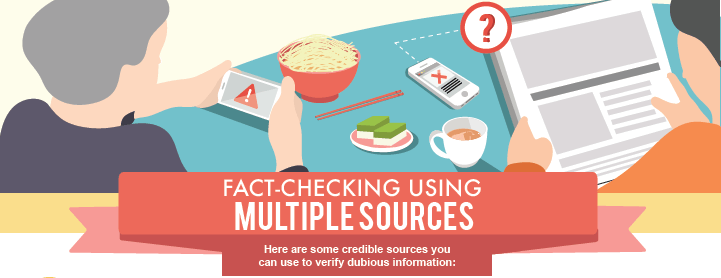
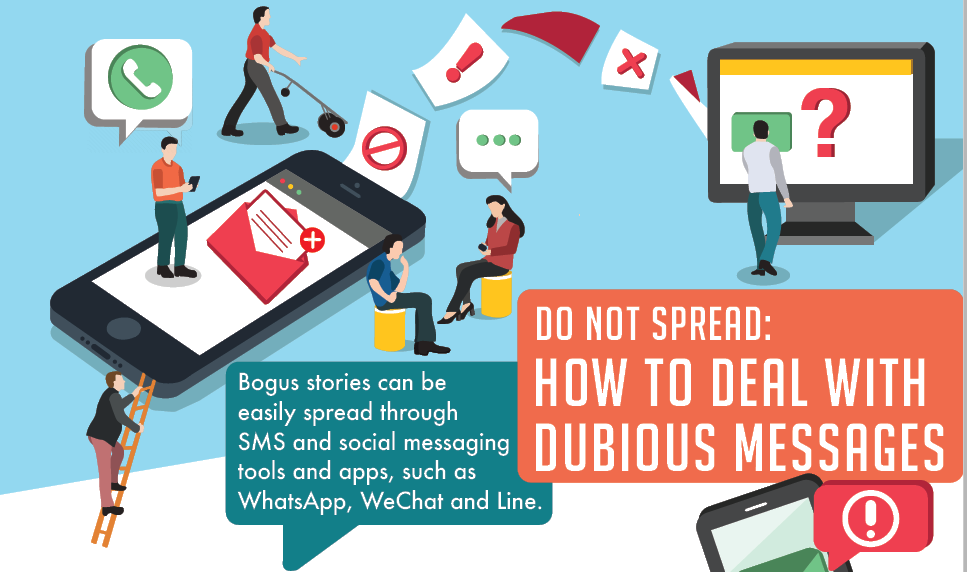
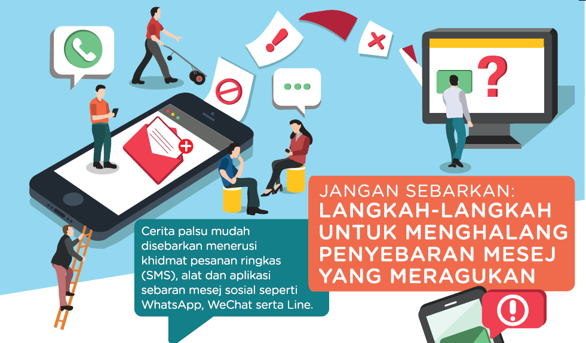
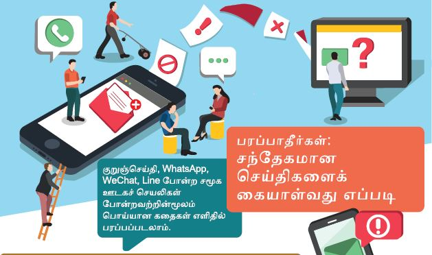
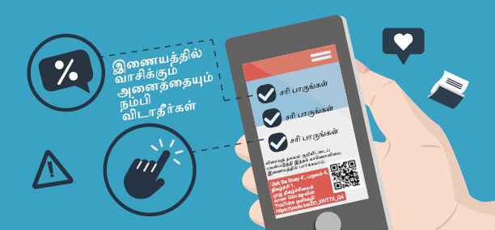

**[Newspaper SG](/infographic/NLB_NewspaperSG_v5.pdf)**
Learn about Newspaper SG, NLB’s online archive of newspapers from Singapore and Malaya and how to think critically when reading news articles.   
](/images/NewspaperSG-masthead-1050x536.png)

**Fact-Checking Using Multiple Sources**
If you receive any dubious information, you can check the facts using credible sources before you share.

**How To Deal With Dubious Messages**
Bogus stories can be easily spread through SMS and social messaging tools and apps. Before you share, verify the information using the steps in this tip sheet. 

**如何查证可疑信息**
虚假信息能够轻易地通过手机简讯、社交平台的私讯工具，以及应用软件散播开来。在点击“分享”之前，请先利用这张提示表里的步骤查证信息的可靠性。

**Langkah-Langkah Untuk Menghalang Penyebaran Mesej Meragukan**
Cerita palsu mudah disebarkan menerusi khidmat pesanan ringkas (SMS), alat dan aplikasi sebaran mesej sosial. Pastikan anda menyemak informasi dengan menggunakan tip-tip  berikut.

**சந்தேகமான செய்திகளைக் கையாள்வது எப்படி**
குறுஞ்செய்தி, சமூக ஊடகச்செயலிகள் போன்றவற்றின்மூலம் பொய்யான கதைகள் எளிதில் பரப்பப்படலாம். பகிர்வதற்ககு முன், இந்த வழிகளின் மூலம் தகவல்களைச் சரி பாருங்கள்.

**மூத்தவர்கள் பொய்யான செய்திகளை எப்படி எதிர்க்கலாம்?**
  இணையத்தில் வாசிக்கும் அனைத்தையும் நம்பிவிடாதீர்கள்.   சந்தேகமான தகவல்களை எப்படிச் சரி பார்க்கலாம் என இந்த குறிப்புத்தாளில் இருந்து தெரிந்து கொள்ளுங்கள்.  
