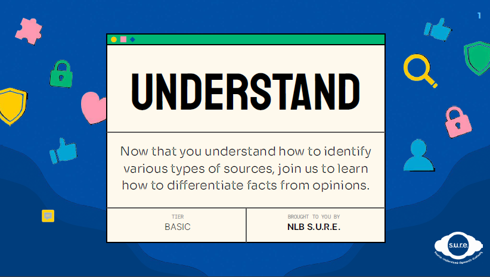
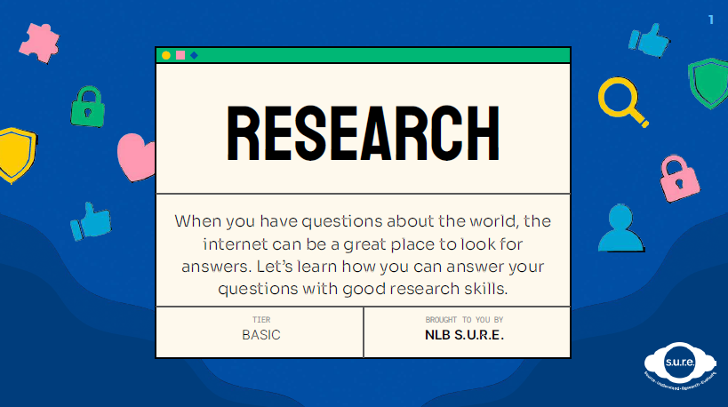
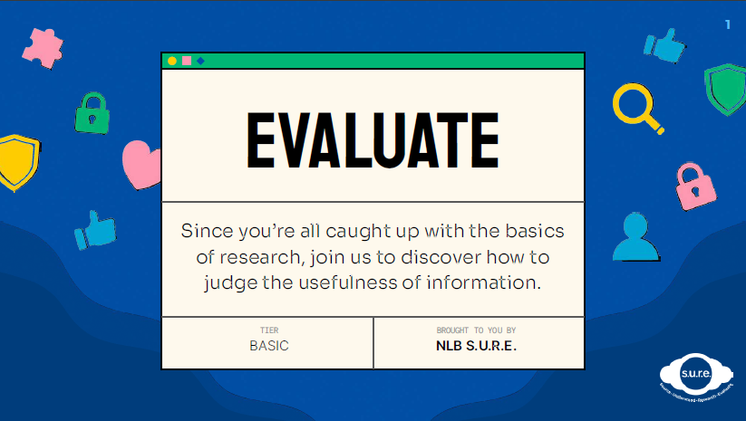

## PART 1 - Using the S.U.R.E. framework (Basic)

### Module IL1 - Source

Information is a big part of our lives. Watch this video to get a deeper understanding of the various sources that provide us with information.

<iframe src="https://nlb.ap.panopto.com/Panopto/Pages/Embed.aspx?id=3086fabd-a88c-4abd-9a3b-aff7001b926d&autoplay=false&offerviewer=true&showtitle=true&showbrand=true&captions=false&interactivity=all" height="405" width="720" style="border: 1px solid #464646;" allowfullscreen allow="autoplay"></iframe>
 

| Activity                                                     |
| ------------------------------------------------------------ |
| Can you tell us if[ this news article about heavy rain in December](https://www.straitstimes.com/singapore/wet-weather-to-continue-with-mercury-to-dip-to-23-deg-c-on-some-days-over-rest-of-december) is a primary, secondary or tertiary source? Write down your thought process and how you identified the source. |

### Module IL2 - Understand

Now that you understand how to identify various types of sources, join us to learn how to differentiate facts from opinions.

Download the PDF slides **[HERE](https://go.gov.sg/sure-il2-basic-slides)**.

| Activity                                                     |
| ------------------------------------------------------------ |
| Take a look at this <a href="https://www.youtube.com/watch?v=pTYr9j6_Ag0&t=1s&ab_channel=Eatbook">Eatbook</a> video. Is the information in the video a fact or an opinion? Why do you think so? |

### Module IL3 - Research

When you have questions about the world, the internet can be a great place to look for answers. Let’s learn how you can answer your questions with good research skills.

Download the PDF slides **[HERE](https://go.gov.sg/sure-il3-basic-slides)**.

### Module IL4 - Evaluate

Since you’re all caught up with the basics of research, join us to discover how to judge the usefulness of information.

Download the PDF slides **[HERE](https://go.gov.sg/sure-il4-basic-slides)**.

| Activity                                                     |
| ------------------------------------------------------------ |
| Take a look at [this video](https://nlb.ap.panopto.com/Panopto/Pages/Viewer.aspx?id=a5054136-b901-44be-b142-af27006a1bef) of 2 friends travelling back in time to the Second World War period. Can you evaluate the video using the S-I-F-T steps? |

