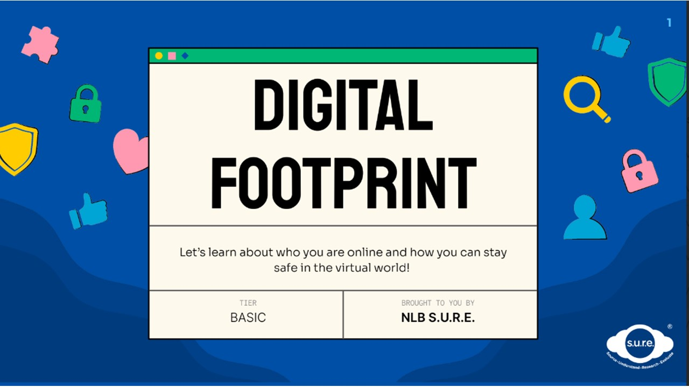
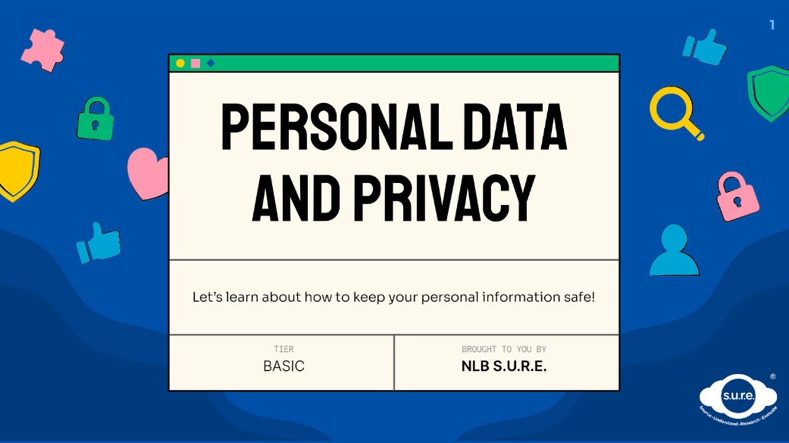

## PART 2 - Digital Safety

### Module DS1 - Digital Footprint

In this topic, you will: 

- Learn about what constitutes a digital footprint
- Understand the difference between a positive and a negative digital footprint
- Explore the concept of your online identity

Download the PDF slides **[HERE](https://go.gov.sg/sure-ds1-basic-slides)**.

### Module DS2 - Personal Data and Privacy

Let’s learn about how to keep your personal information safe!

Download the PDF slides **[HERE](https://go.gov.sg/sure-ds2-basic-slides)**.

