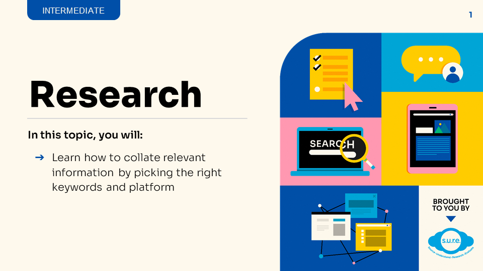
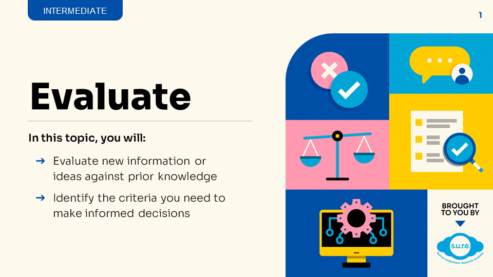

## PART 1 - Using the S.U.R.E. framework

### Module IL1 - Source

<iframe src=https://nlb.ap.panopto.com/Panopto/Pages/Embed.aspx?id=7c6428a8-aec2-41d7-acde-aff7001f8fd9&autoplay=false&offerviewer=true&showtitle=true&showbrand=true&captions=false&interactivity=all height="405" width="720" style="border: 1px solid #464646;" allowfullscreen allow="autoplay"></iframe>

Download the Infographic [**HERE**](https://go.gov.sg/sure-phase1-inter-info).

## 

### Module IL2 - Understand

Download the PDF slides **[HERE](https://go.gov.sg/sure-il2-inter-slides)**.

### Module IL3 - Research

Download the PDF slides **[HERE](https://go.gov.sg/sure-il3-inter-slides)**.

### Module IL4 - Evaluate

Download the PDF slides **[HERE](https://go.gov.sg/sure-il4-inter-slides)**.

