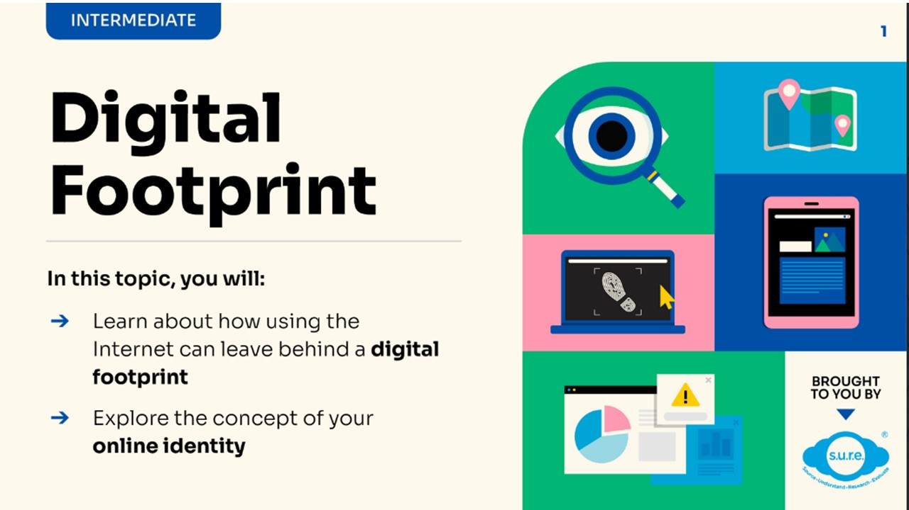
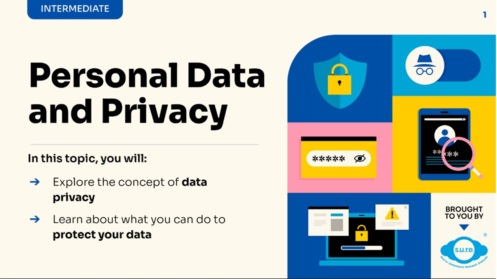

## PART 2 - Digital Safety (Intermediate Level)

### Module DS1 - Digital Footprint

In this topic, you will: 

- Learn about how using the Internet can leave behind a **digital footprint**
- Explore the concept of your **online identity**

Download the PDF slides **[HERE](https://go.gov.sg/sure-ds1-inter-slides)**.

### Module DS2 - Personal Data and Privacy

In this topic, you will: 

- Explore the concept of **data privacy**
- Learn about what you can do to **protect your data**

Download the PDF slides **[HERE](https://go.gov.sg/sure-ds2-inter-slides)**.

