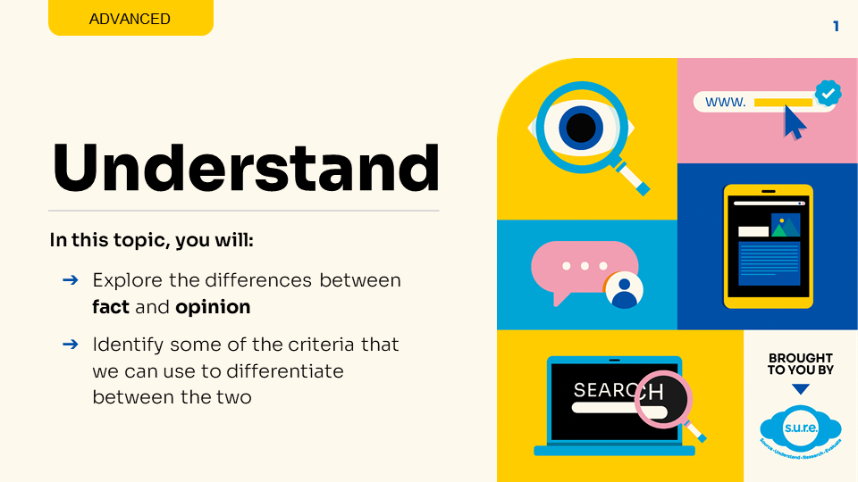
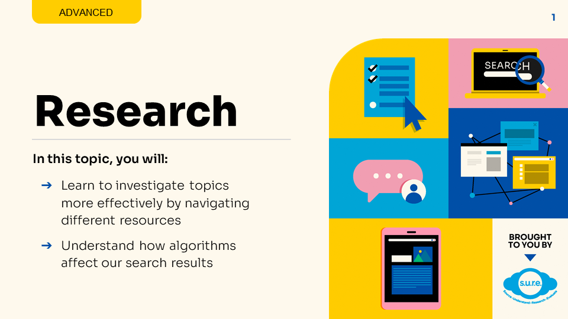
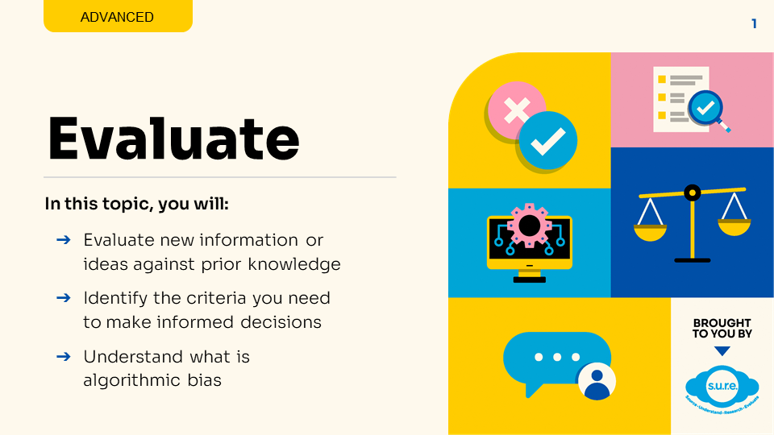

## PART 1 - Using the S.U.R.E. framework

### Module IL1 - Source

<iframe src="https://nlb.ap.panopto.com/Panopto/Pages/Embed.aspx?id=9b02147b-fed7-43bd-a906-aff70025e75a&autoplay=false&offerviewer=true&showtitle=true&showbrand=true&captions=false&interactivity=all" height="405" width="720" style="border: 1px solid #464646;" allowfullscreen allow="autoplay"></iframe>
 

Download the Infographic **[HERE](https://go.gov.sg/sure-phase1-adv-info)**.

### Module IL2 - Understand

Download the PDF slides **[HERE](https://go.gov.sg/sure-il2-adv-slides)**.

### Module IL3 - Research

Download the PDF slides **[HERE](https://go.gov.sg/sure-il3-adv-slides)**.

### Module IL4 - Evaluate

Download the PDF slides **[HERE](https://go.gov.sg/sure-il4-adv-slides)**.

