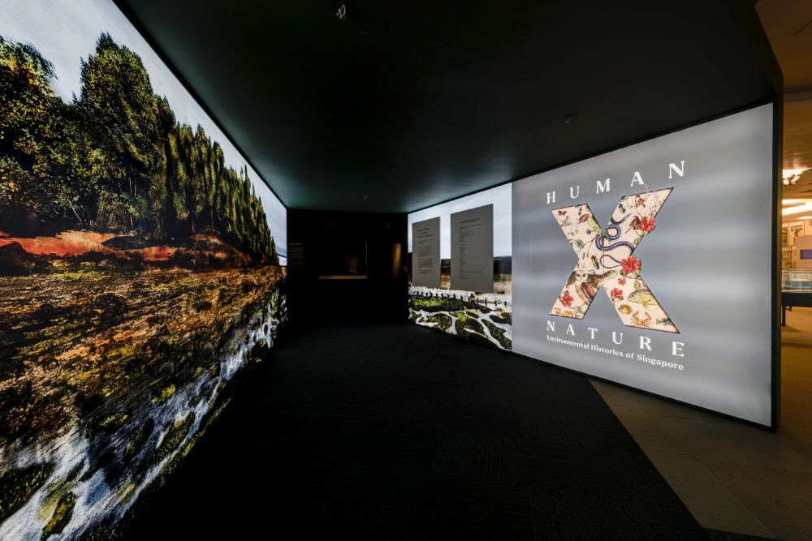

**Introduction:** Join us on an online learning journey of the brand new exhibition **[Human x Nature](https://exhibitions.nlb.gov.sg/exhibitions/current-exhibitions/humanxnature/)**, which explores our relationships with the natural world from cultural understandings and scientific study to conservation and restoration.  Through the guided virtual tour, students will get to explore interesting facts and stories behind the dazzling array of natural history artefacts and specimens. Grab this opportunity to learn more about biodiversity in Singapore!  

**Programme Details:** This virtual tour cum workshop is conducted digitally. Student cohort-sized audiences can be accommodated. As Kahoot! will be utilised to engage the students in quizzes and activities, the usage of smartphones or Personal Learning Devicesvi (PLDs) are recommended. In the event that smart devices cannot be used, an activity worksheet will be sent to the teachers to print out for the students. 

**Target Audience:** Students

**Programme Runtime:** Limited run only (Term 3, 2021)

**Due Date for Registration:** Register 2 weeks in advance (preferred)

**Duration of Session:** 1 hour

**Programme Fee:** Free-of-charge

**Programme Capacity:** Minimum of 40 pax

**Contact Information:** E-mail us at [sure@nlb.gov.sg](mailto:sure@nlb.gov.sg) for enquiries & registration

 