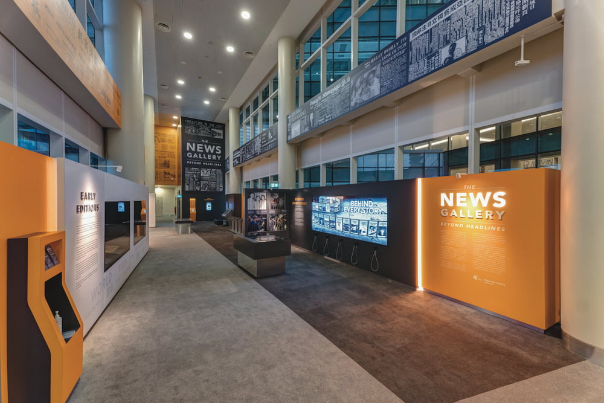

**Introduction:** *The News Gallery* is an exhibition at the National Library featuring Singapore's earliest newspaper collections and interactive stations. In this programme, students will be taken on a fun and interactive learning experience that combines a virtual tour of *The News Gallery* and a workshop to pick up important media and information literacy skills. 

Students will learn about the evolving issues related to news media and online information. They will also learn about the rising trend of fake news and the [NLB’s S.U.R.E.](https://sure.nlb.gov.sg/about-us/sure-campaign/) (Source, Understand, Research, Evaluate) steps to combat their spread. S.U.R.E. is part of [Digital Defence](https://www.mci.gov.sg/portfolios/digital-defence/digital-defence), the sixth pillar in Total Defence, to guard against threats in the digital domain.

**Programme Details:** This tour cum workshop is conducted digitally. Student cohort-sized audiences can be accommodated. As [Kahoot!](https://kahoot.it/) will be utilised to engage the students in quizzes and activities, the usage of smartphones or Personal Learning Devices (PLDs) are recommended. In the event that smart devices cannot be used, an activity worksheet will be sent to the teachers to print out for the students. 

**Target Audience:** Students

**Programme Runtime:** All year round (from Term 4, 2021 onwards)

**Due Date for Registration:** Register 1 month in advance (preferred)

**Duration of Session:** 1 hour

**Programme Fee:** Free-of-charge

**Programme Capacity:** Minimum of 40 pax

**Contact Information:** E-mail us at [sure@nlb.gov.sg](mailto:sure@nlb.gov.sg) for enquiries & registration

 