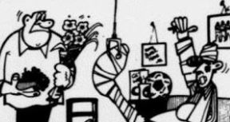

Do you know that there is a fun side to newspapers too? Some pages are filled with comics and puzzles, food and film reviews, fashion and health tips, photo features, travel articles, agony aunt columns and more. Try your hand at spotting the difference! How many can you find? 

Try out this [**ACTIVITY**](https://go.gov.sg/tng-primary-activity2) now!

