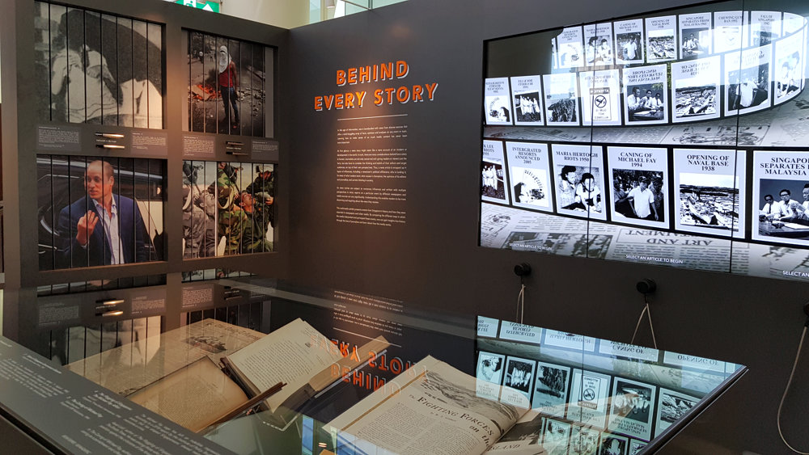

News stories are subject to many influences and written in multiple viewpoints. Thus, the same topic, reported by different newspapers and media sources can vary significantly. Primary school kids can learn about sensational headlines, confirmation bias and media frames, through this activity.

Try out this [**ACTIVITY**](https://go.gov.sg/tng-primary-activity3) now!

