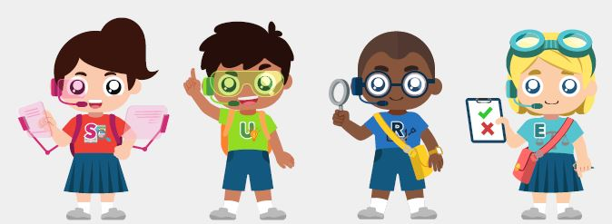
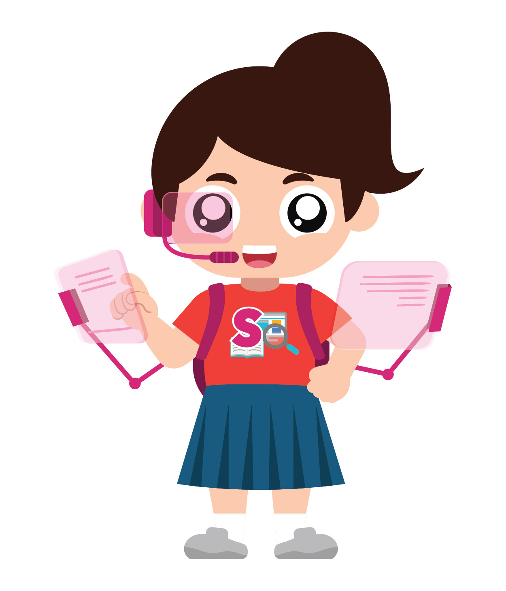
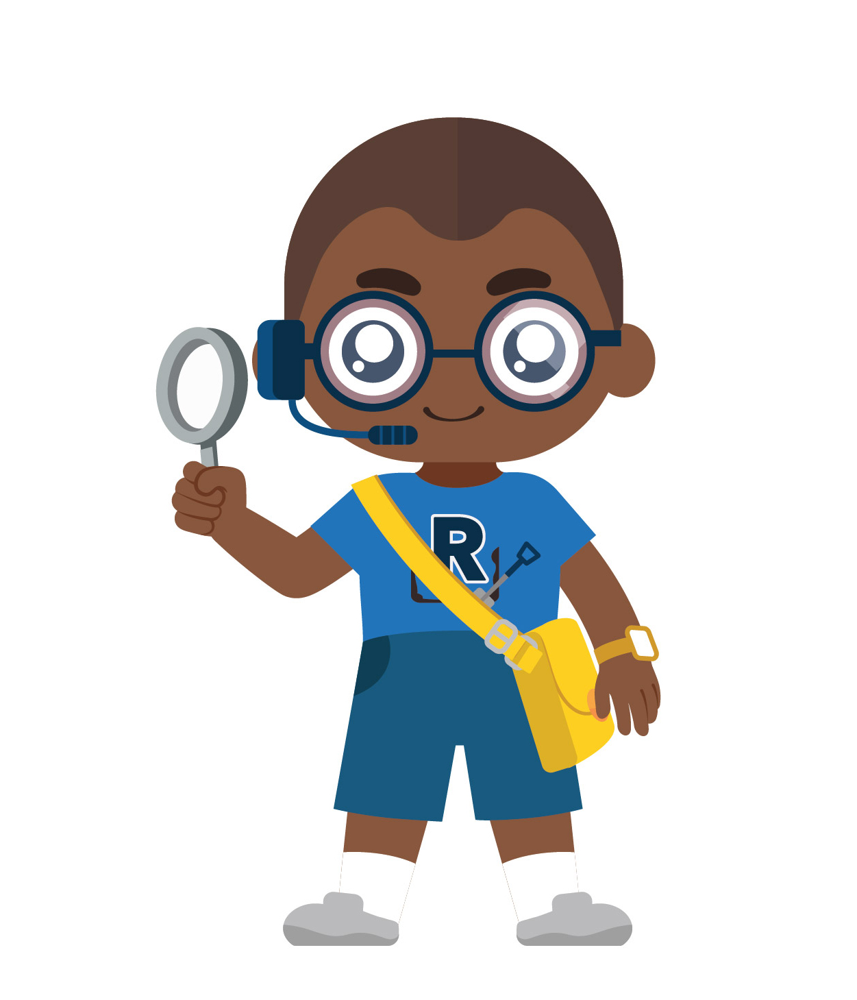
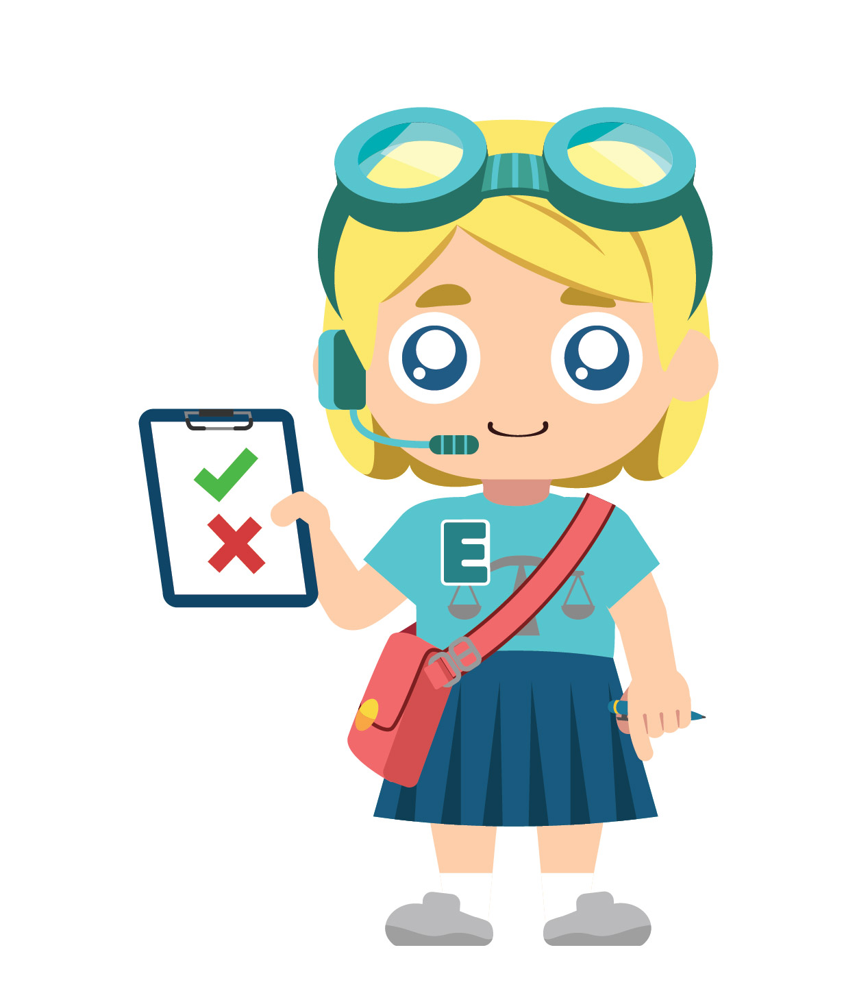

Introducing the **SUREvivors**:  Source-Finding Sarah, Understanding Upin, Researching Raju and Evaluating Emma! Together, they teach students how to be S.U.R.E. and discern false information.

|                                    |                                                              |
| ---------------------------------- | ------------------------------------------------------------ |
|  | **Source-Finding Sarah** looks at the origin of her sources to see if they are trustworthy. She believes strongly in checking the credibility and reliability of a source of information. Armed with her tablet computers, books and maps, she examines her various sources first before believing them. |
|                                    |                                                              |
|   | **Understanding Upin** always makes sure he knows what he is reading and searches for clarity in his information. He spends time thinking about whether his information is backed up by evidence, and if they are facts and not opinions. |
|                                    |                                                              |
|   | When **Researching Raju** does his research, he digs deeper and goes beyond the initial source that he finds. With his trusty magnifying glass, he searches for different credible sources to cross check the accuracy of the information that he needs. |
|                                    |                                                              |
|   | **Evaluating Emma** finds the balance in her information. The scale of justice on her t-shirt reminds her to exercise fair judgement in anything that she reads. After getting the information, she will go through everything again with her checklist and clipboard to make sure that she has looked from different angles, because she knows that there is at least two sides to a story. |

