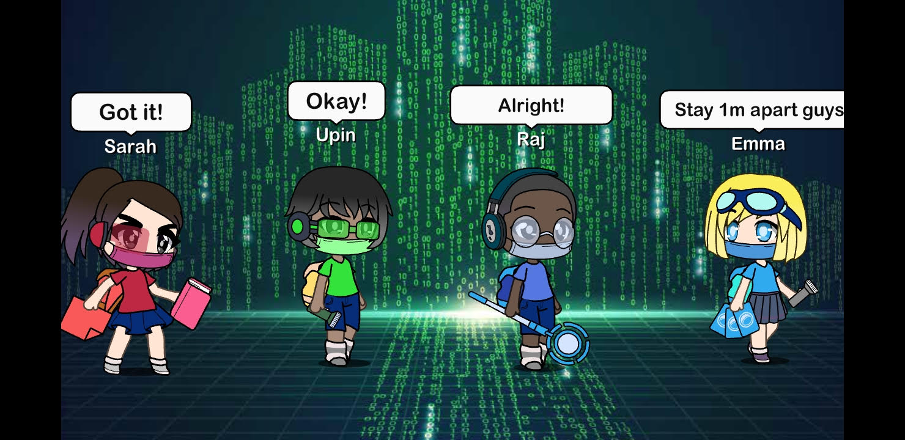

**Fake News Busters Activity 1**

Hi everyone, let’s create a collaborative story about their adventures! You can draw or use any digital tool or app to tell YOUR story or stories! Please refer to [this page](/tng/fakenewsbusters/) for the character descriptions.

When you are done, you can post it in your social media account (e.g. Instagram or Facebook) and tag us **@nationallibrarySG**  with these hashtags:  **#fakenewsbusters #beSURE  #NLBnewsgallery**. We will highlight the best entries here.

In this example below, we used “Gacha Life” to create this cartoon panel.  As you can see, the FNB team is also masking up and maintaining their social distance in cyberspace.

