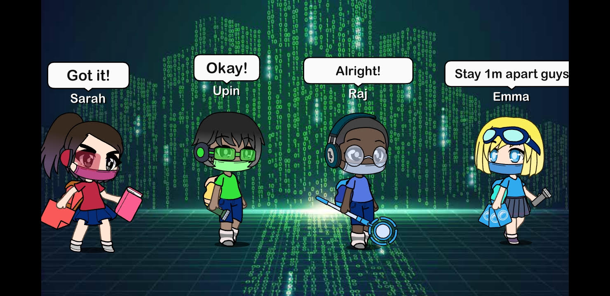

## Create Your SUREvivors Story

Hi everyone! 

 

What will the SUREvivors explore next? Create your own SUREvivors adventures! You can draw or use any digital tool or app to tell YOUR story or stories! Please refer to [this page](https://sure.nlb.gov.sg/tng/surevivors/) to get to know the characters!

 

When you are done, you can post it in your social media account (e.g. Instagram or Facebook) and tag us **@nationallibrarysg** with these hashtags: **#SUREvivors #beSURE #NLBnewsgallery**. We will highlight the best entries here.

 

In this example below, we used “Gacha Life” to create this cartoon panel. As you can see, the SUREvivors are also masking up and maintaining their social distance in cyberspace.

Stuck with ideas on your story? Here are [some tips](https://www.kidlit.tv/2016/10/how-to-make-a-comic/):

**1. Pick a character**

Who is your story about? Is it about Researching Raju exploring the different books in the library? Or Understanding Upin’s adventures in fighting fake news?

 

**2. Sketch your character**

Is your character feeling happy or sad? Are they doing something? Maybe Source-Finding Sarah is searching for the writer of a news article!

 

**3. Brainstorm a plot**

What does your character want to do? Unpacking a mysterious Whatsapp message? Helping their family members find the latest news? Where is this happening?

 

**4. Plan your storyline.**

What happens at the beginning, middle and end of the story? Remember to think about what they will say!

 

**5. Create your story!**

 

Start creating your own adventures with these tools below:

·    [Storyboard That](https://www.storyboardthat.com/) 

·    [Canva](https://www.canva.com/create/comic-strips/) 

·    [Pixton](https://www.pixton.com/student-comic-builder) 

·    [Powerpoint](https://youtu.be/OZUkNY97nzk)  

 

You can also take a picture of your drawing and post it on your social media account. Just remember to tag us @nationallibrarysg! 

