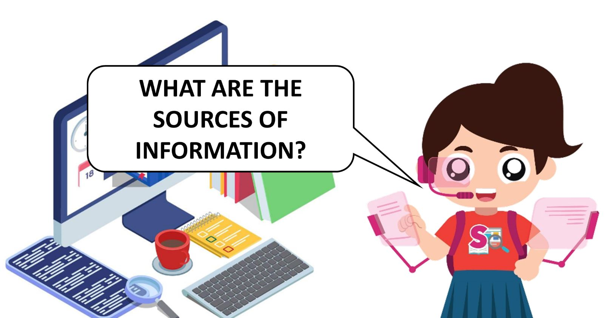
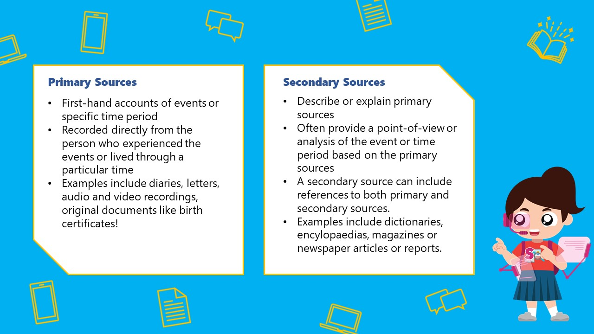
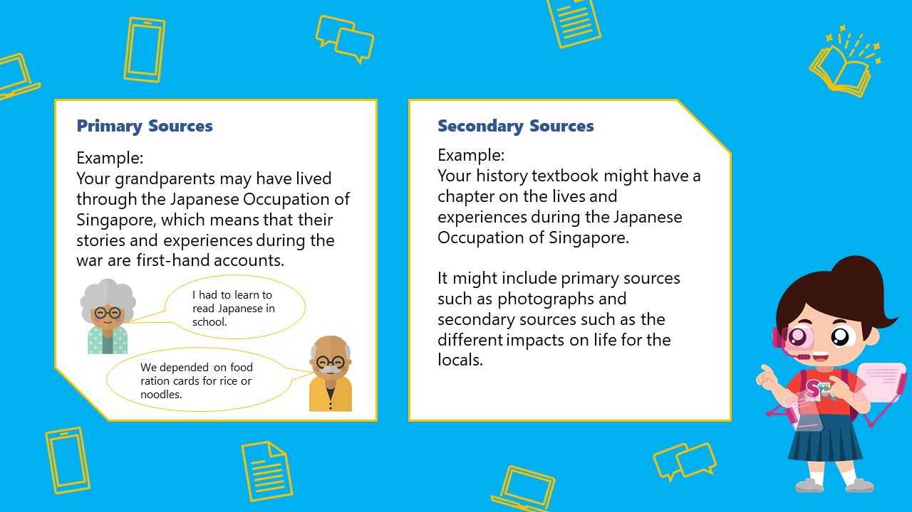
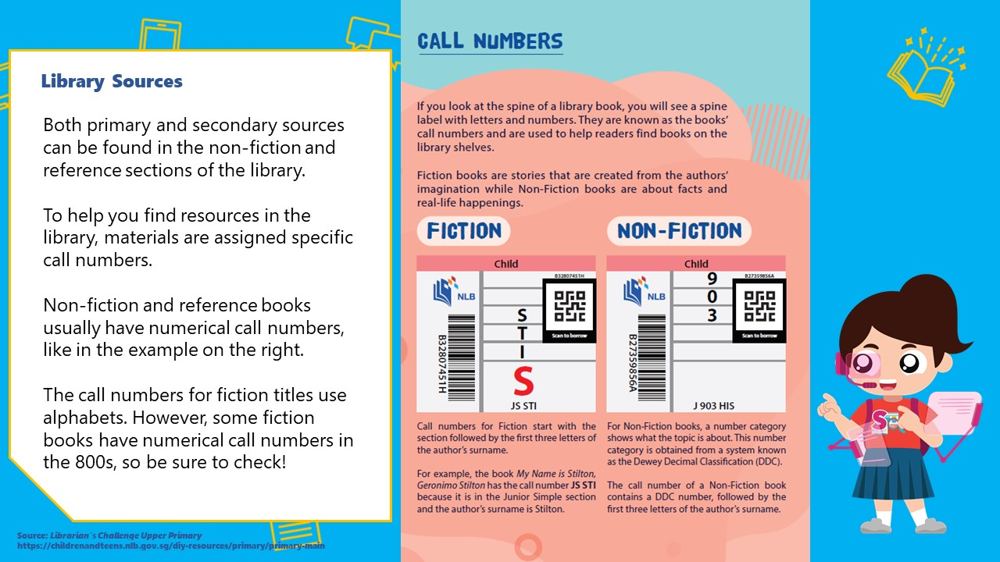
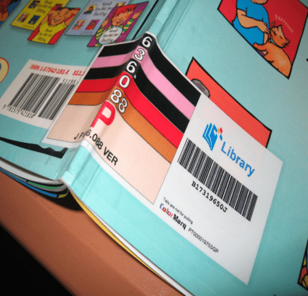

## Primary and Secondary Sources

Hi everyone! I'm Source-Finding Sarah, part of the SUREvivors team. I will help you to learn more about what different sources of information are. After that, take my [online quiz](https://forms.gle/LobqaT7jbR9xun49A) to test your knowledge!
 

There are many types of sources of information out there:

- Books
- Magazines
- Encyclopaedias
- Newspapers
- Websites

You would definitely have used at least one of them! These sources of information can either be primary or secondary. 

What is the difference between the two, and how can you tell if what you are using is a primary or secondary source of information? Read on to find out more!

 

You are now ready to take the quiz! Click on this link to test your knowledge: 

**[START QUIZ](https://go.gov.sg/surevivor-activity-3)**

 
