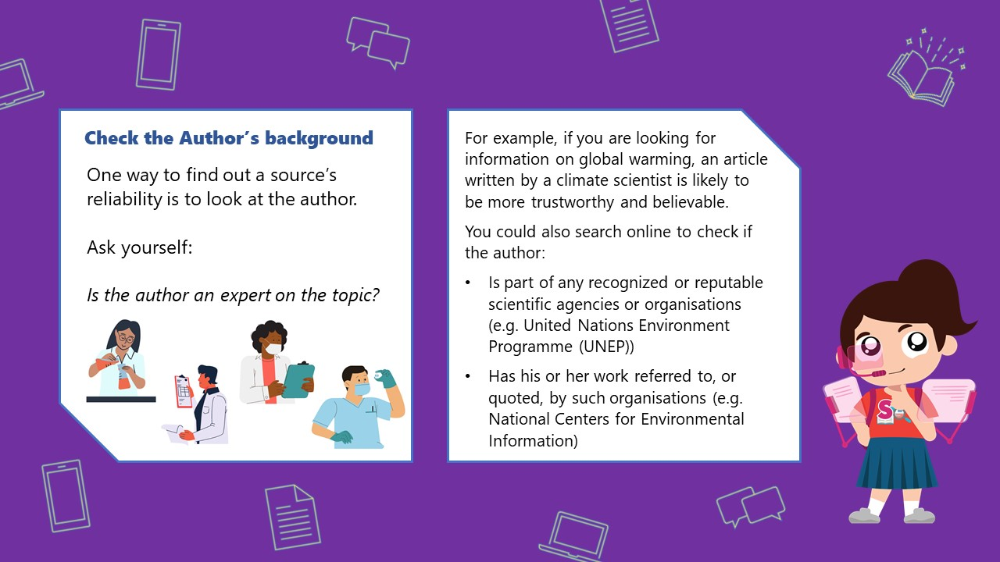

## How Do You Check the Reliability of Sources of Information?

Hi everyone, it’s me, Source-finding Sarah! I hope that you tried my previous quiz about sources of information. Today, we will learn how to check the reliability of these sources! 

Please read the short article below, before you **[START THE QUIZ](https://go.gov.sg/surevivor-activity-4)**.

You may come across many primary and secondary sources of information while doing research for your homework or project work. How can you be sure if the sources you find are trustworthy and credible (or believable)? 

 

**Reliable Sources of Information**

One place you can get reliable sources of information from is the library! 

*1. Books and Magazines*

You can refer to books or authoritative magazines (such as those published by well-known and well-recognised scientific institutions) for your research. These publications will often include their sources of information for further reading under their “references” section.

*2. E-books and e-magazines*

Some of these materials are even available online on the National Library Board’s [eResources website](https://eresources.nlb.gov.sg/main)! All you need is a [myLibrary username](https://www.nlb.gov.sg/Portals/0/IMG/VisitUs/Membership_Guide/myLibrary_ID_Registration_Guide.PDF) to access these eResources. Here are some useful resources you can start exploring:

-  **[Overdrive](https://nlb.overdrive.com/)** *for a range of ebooks, audiobooks and magazines.*

-   **[Gale Literature: Books and Authors](https://eresources.nlb.gov.sg/main/Browse?startsWith=G)** *for a range of fiction and non-fiction ebooks for children, teenagers and adults.* 

   

*3. Newspapers*

Newspapers are a great source of information. Reputable newspapers will fact-check reports and correct errors made by their reporters. Here’s how you can access newspapers in our collection:

- **[NewspaperSG](https://eresources.nlb.gov.sg/newspapers/)** *for online access to older Singapore newspapers* 

- **[Newslink](https://eresources.nlb.gov.sg/main/Browse?startsWith=N)** *for Singapore Press Holding’s recent newspapers in English, Chinese, Malay and Tamil.* 

- **[PressReader](https://eresources.nlb.gov.sg/main/Browse?startsWith=P)** *for current local and international news.* 

   

*4. Online websites*

Thanks to the internet, information is at our fingertips! It’s usually our first go-to place when searching for information. However, with the vast amount of information available online, you must be extra careful that the websites are authoritative or associated to credible organisations. 

 One way to check if an online source of information is trustworthy or reliable is to look closely at the website. 

Now that you have a better idea of how to ensure that your sources of information are reliable, take this quiz to test your knowledge! 

You can access the quiz **[HERE](https://go.gov.sg/surevivor-activity-4)**.

