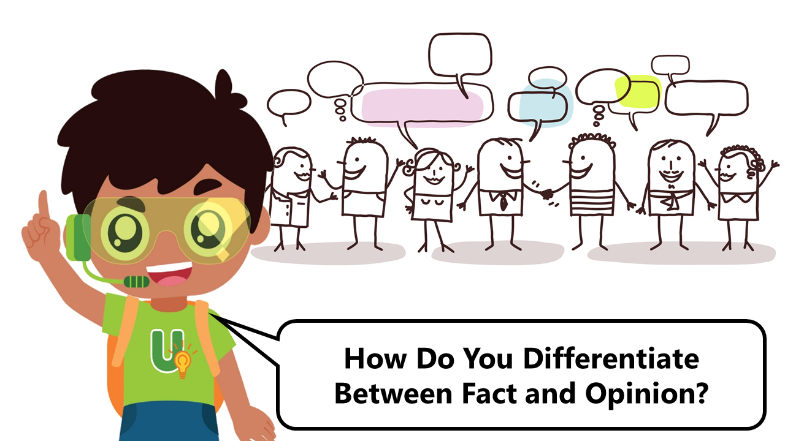

## How Do You Differentiate Between Fact and Opinion?

## 

Hi, I’m Understanding Upin, part of the SUREvivors team! By now you should have learnt about sources of information and how to check their reliability with my friend Source-Finding Sarah. When conducting research for your homework or project work, you’ll often come across sources of information that present facts or opinions. I’ll be helping you to find out more about what they are and how to differentiate between them! 

**Facts**

What are facts? Facts are statements that are true and can be verified objectively or proven. In other words, a fact is true and correct no matter what. Here are some examples of facts: 

\-      The sun is a star.

\-      Humans are mammals.

\-      Living things need air, food and water to survive.  

**Opinions** 

Opinions are statements that reflect the views or ideas that people have about subjects and topics. For example, your friend says that all ice cream is tasty. This is their opinion, because not everyone may think the same way, nor can it be proven to be true. Opinions may not be rooted in fact or be supported by strong evidence, though there are exceptions, such as in the case of expert opinions.

Sometimes, the language used in opinions can be deliberately emotional to mislead others. Therefore we need to know the purpose of the message or information. Is it to inform or persuade you to do something or buy a product?

 

**Differentiating Fact and Opinion**

Here are some tips on how to differentiate between fact and opinion. Firstly, ask yourself, “Can it be proven”? Evidence to support a fact can be easily found in books in a library’s reference section, as well as by searching online using reliable sources of information, such as the websites of reputable educational institutions. These sources will provide evidence for the same fact. However, for opinions, what is stated may differ across sources of information. 

Facts will also be unbiased. They do not support only one perspective and present the information in an objective manner. For opinions, the author’s writing might be biased and written in a way to try to persuade the reader to believe in what he or she is saying. 

I hope that you now know more about facts and opinions! When doing research, try to look for facts instead of opinions as they are supported by evidence. 

Now, test out what you have learnt in this quiz **[HERE](https://go.gov.sg/surevivor-activity5)**.

