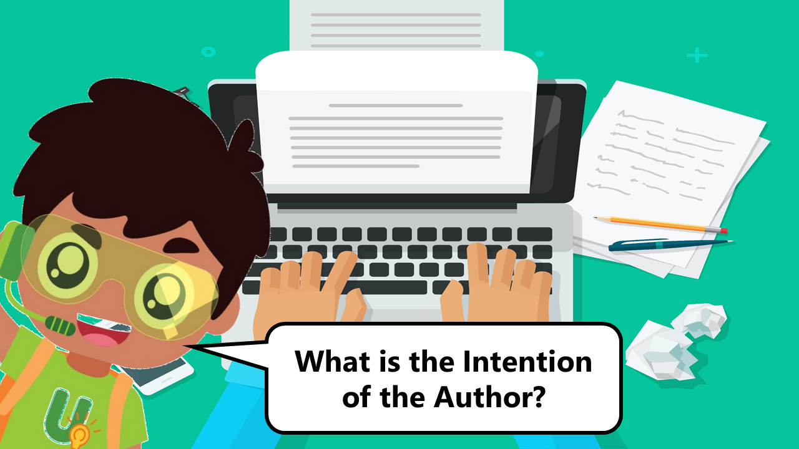

## **Understanding Upin – What Intentions Can An Author Have?**

Hi everyone, it’s me again, Understanding Upin! Did you try out my previous quiz on differentiating between facts and opinions? Today, we will learn more about what intentions authors may have when they write something. Usually, these intentions are to inform, entertain or persuade. If the main intention of the author is to persuade you to believe in something and what he or she has presented only supports one side of the story, it may affect the credibility of the information provided. 

## Articles and Reviews

When people write articles, the language they use may persuade you to believe in certain messages they want to bring across. For example, a publishing company that has published children’s books may hire people to write articles to speak highly of them. They may also talk about how interesting or exciting the storylines are in order to persuade you to purchase them. 

In another example, a toy reviewer on YouTube may record a video speaking highly of certain toys, or provide website links with more information about them. You may want to question if the toy reviewer has been paid by the toy companies so that more children will be persuaded to ask their parents to buy them.  If there are such intentions made by the reviewer, you may want to question if the information that you are reading is credible. 

## Advertisements   

You would definitely have come across advertisements as well, be it on the internet, television, brochures or even when you are just walking on the street. Their intention is to persuade you to buy whatever product they are advertising. This can be done by making the images of the product look attractive, or showing you the reactions of people using them. For example, an advertisement about an air conditioner may show people enjoying the comfort of a cool room with happy and relaxed expressions, and also elaborate on how the particular model saves energy at the same time. This will persuade people to purchase the air conditioner to get the same experience. 

Sometimes, advertisements can come in more subtle forms too. They can be presented as articles, but are actually sponsored by the company to persuade people to buy their products. For example, an article in a parents magazine can be written featuring interviews from children on how they have benefited from using some educational game software. However, this article could have been sponsored by the company to persuade the parents to buy the game software for their children. 

When you come across information, always be sure to question the intention of the authors as they may want to persuade you to believe in certain messages to their own benefit, or that align to their own experiences and beliefs. You will then have to refer to other unbiased sources of information that present the different sides of the story which would be more credible than those that only present one side. 

Now that you know more about how to identify the intentions of the author, try out this quiz **[[HERE](https://go.gov.sg/surevivor-activity6)]**.

