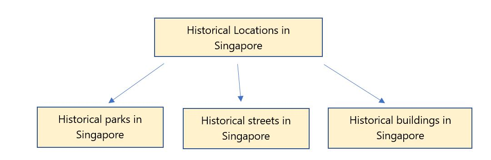

## How to Search for Information Effectively: Narrowing and Broadening Search Terms

Hi everyone, I’m Researching Raju, part of the SUREvivors team! I’m taking over from my friends, [Source-finding Sarah](https://sure.nlb.gov.sg/tng/surevivors-activity3/) and [Understanding Upin](https://sure.nlb.gov.sg/tng/surevivors-activity5/). You’ll learn more about how to conduct research for your project work or homework with me. When doing your research, you may come across a lot of information on the internet, which may be overwhelming. How can you search for information more effectively? Here are some steps that you can follow. 

**Identifying Keywords** 

Once you have the subject or topic for your research, think about the keywords you want to focus on. For example, if you have to write a report on historical places in Singapore, how can you narrow the topic down? 

This is one method that you can use: 

You can think about the different types of historical places in Singapore and then further narrow down your topic, as shown in the diagram above. 

For example, if you choose to focus on the historic parks in Singapore, here are some phrases that you can use to narrow down your topic: 

- *“Singapore's oldest park”*
- *"Fort Canning Park"*
- *"Singapore Botanic Gardens"*
- *"heritage parks Singapore"*

Narrowing the scope of your topic is important, otherwise the information that you retrieve may be overwhelming and make it difficult for you to start your research. 

However, what if after narrowing down your topic, you are unable to find any relevant information? You can broaden your search by using synonyms. Synonyms are words with the same meaning. For example, a synonym for “park” may be “garden” (e.g. Botanic Gardens). This is one method you can use to generate more search results. 

**Search for Information**

After you have decided on your topic and keywords, think about the various sources of information for your research, such as reference books from the library or online. 

Your first port-of-call in finding resources from the library will most likely be the library catalogue. You can access this online at catalogue.nlb.gov.sg to search for materials in the National Library Board’s collection. 

After identifying the books that you need from the online catalogue, you can look for them in the library. Physical reference books often include an index with keywords that will direct you to the pages with relevant information for your topic. This will help you find the content that you need more quickly. 

Do note that if you search for information online, you’ll need to make sure that the websites you use are credible and reliable. If you’re not sure about this, [check out](https://sure.nlb.gov.sg/tng/surevivors-activity4/) what my friend Source-Finding Sarah has said about them! 

I hope that you have learnt more about how to search for information effectively. Test out your newfound knowledge in this **[QUIZ](https://go.gov.sg/surevivors-activity7)**. 

