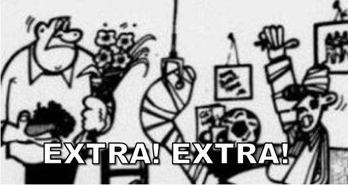
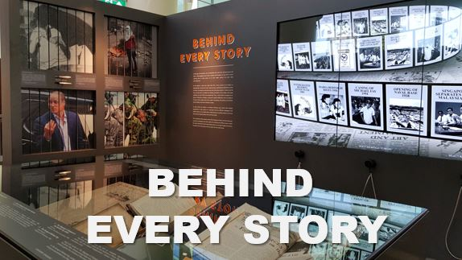
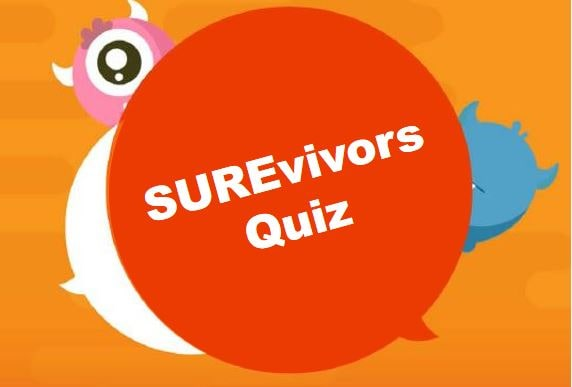
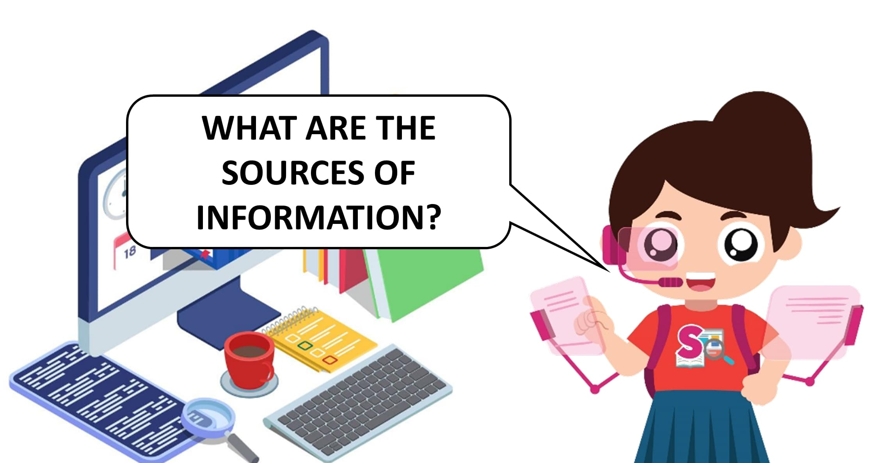
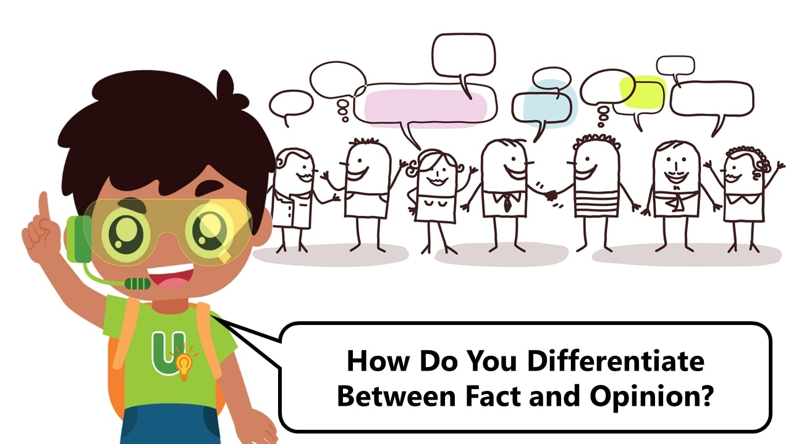
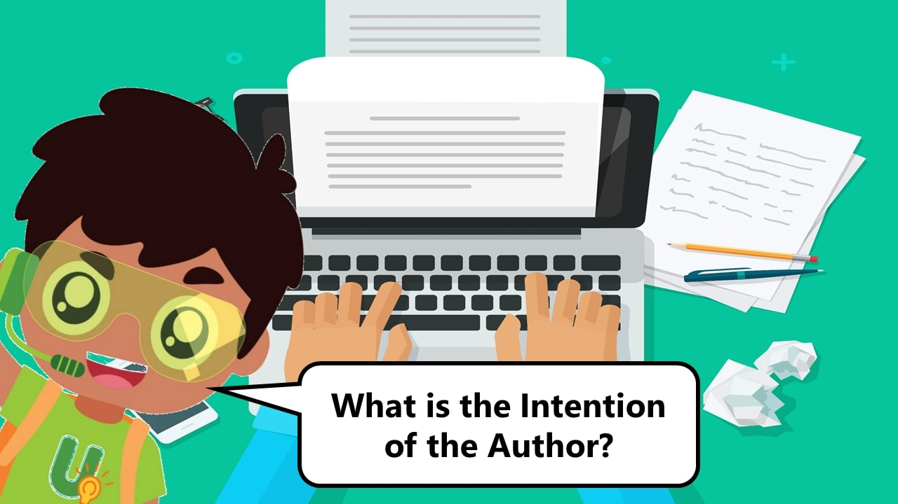

Welcome to the educational resources page for [***The News Gallery: Beyond Headlines***](https://exhibitions.nlb.gov.sg/exhibitions/current-exhibitions/newsgallery) permanent exhibition. 

**What's new:**

- [The News Gallery Virtual Tour and Workshop](https://sure.nlb.gov.sg/tours-and-workshops/tng-virtual-tour/) 
- [Activity Sheets for Primary and Secondary schools](/tng/activity-sheets/)

We have prepared a series of online activities for you:

## **Primary School Activities:**

	

    

    

	

`

## SUREvivors Activities

    

    

    

    

    

    

    

	

Launched in March 2020, The News Gallery aims to provide a platform to explore issues relating to information and mass media, while showcasing the rich resources on Singapore newspapers in the National Library. It tells the stories of newspapers in Singapore and uncovers key historical events of the nation through the perspectives of news reports. It explores the phenomenon of fake news and offers lessons on how we can prevent its spread. Also presented are features of the newspaper beyond the news, from comics and puzzles to photojournalism, which continue to enlighten, engage and entertain readers. 
