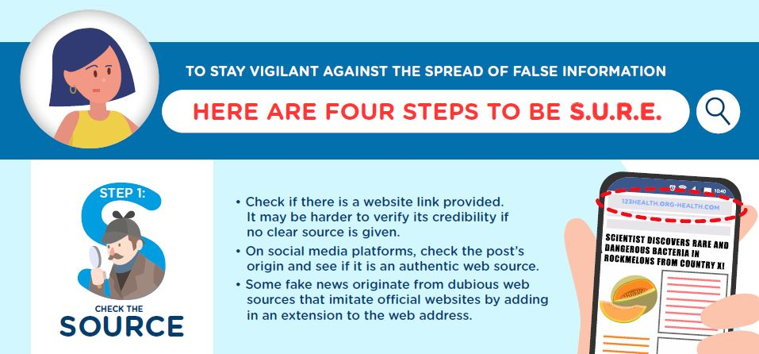

Hi everyone,

We have a new e-Presentation and new infographic on applying the four  S.U.R.E.  steps to verify dubious information. Feel free to share this with your family and friends!

#### **[e-Presentation] How to be S.U.R.E. before you share**

Learn how to safeguard yourself and others against online falsehoods by using the National Library Board's S.U.R.E. steps. 

<iframe src="https://player.vimeo.com/video/404475923" width="640" height="360" frameborder="0" allow="autoplay; fullscreen" allowfullscreen></iframe>

**[Infographic] How to be S.U.R.E. before you share**

Download the full infographic [HERE](/infographic/4-Ways-of-SURE.pdf).

Check out the SURE animated video **[HERE](/blog/fake-news/fn0004)**.

