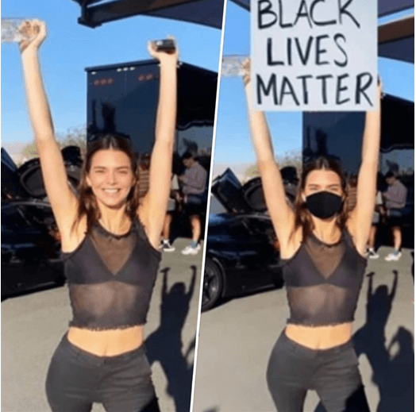

In today’s world, false information is chipping away our trust in media, people and resources around us. As we spend much time in the online space, it is more important than ever to separate truth from fiction.

The election period will see a tremendous volume of online campaigning and civic participation. Much of this is now being done in new and creative ways – engaging videos, relatable memes, catchy and viral multimedia content shared through social media and private messaging.

On the receiving end of this flood of information and material, we must all be even more cautious and alert than before – to avoid being victims of scams, misinformation, and even interference in our elections. 

Overseas, there have been many examples of videos and photographs being doctored to influence politics. No sophisticated tools or techniques are necessary to create such deceptive content. Many would be familiar with these incidents:

- A video of a politician was slowed down to make it sound like she was slurring, to mock and discredit her.

|                               |
| :----------------------------------------------------------: |
| *Doctored video of US politician Nancy Pelosi* Source: [The Guardian](https://www.google.com/amp/s/amp.theguardian.com/technology/2019/may/24/facebook-leaves-fake-nancy-pelosi-video-on-site) |
|                                                              |

- An image of a politician waving a flag was edited to replace it with a different flag, inflaming tensions in a fragile
  situation.

|                             |
| :----------------------------------------------------------: |
| *Doctored and original photos of Hong Kong politician Junius Ho* Source: [AFP Fact Check](https://factcheck.afp.com/image-has-been-doctored-photo-hong-kong-politician-junius-ho-waving-chinese-flag-beijing) |

- Even celebrities have had their photos edited by others, to associate them with political movements.

|                             |
| :----------------------------------------------------------: |
| *Original and edited image of US celebrity Kendall Jenner* Source: [Yahoo News](https://www.google.com/amp/s/news.yahoo.com/amphtml/kendall-jenner-sets-record-straight-173836639.html) |

Over the election period, we may well see more manipulated content, given the ease with which it is created and spread. For instance, in Singapore, there has already been a confusing video circulating on WhatsApp, which appears to show people overseas carrying banners and slogans related to our local politics. These are actually clips from movies and other videos, which were edited to superimpose those slogans. The video editing software that was used is one of many that can be downloaded online for free.

 

When it is hard to tell the truth, we are less able to make well-informed decision in many situations. Here are 4 SURE steps to help you discern information:

 

**Source**: On social media platforms, check the post’s origin and see if it is an authentic web source. Some fake news originate from dubious web sources that imitate official websites by adding in an extension to the web address. 

 

**Understand** the difference between factual information and opinions. Content based on facts are not influenced by personal feelings, opinion or beliefs. News story should give accurate information and be objective (opinion-free).

 

**Research:** Go beyond the initial source. Do a quick search of any suspicious news you receive. Treat it with suspicion if there is lack of news coverage or evidence. Find at least two or more sources to confirm if the information is real. Use credible sources to find out if an article or message you received is authentic.

 

**Evaluate**: Look for a balance in all points of views (different perspectives) in the information you are reading. There are at least two sides to every story. Also consider if the headline, video or photo has been doctored or faked to fit a certain narrative.

 

Be **SURE** before you choose to believe, share or forward the information!

Download our infographic **[HERE](/infographic/4-Ways-of-SURE.pdf)**.

