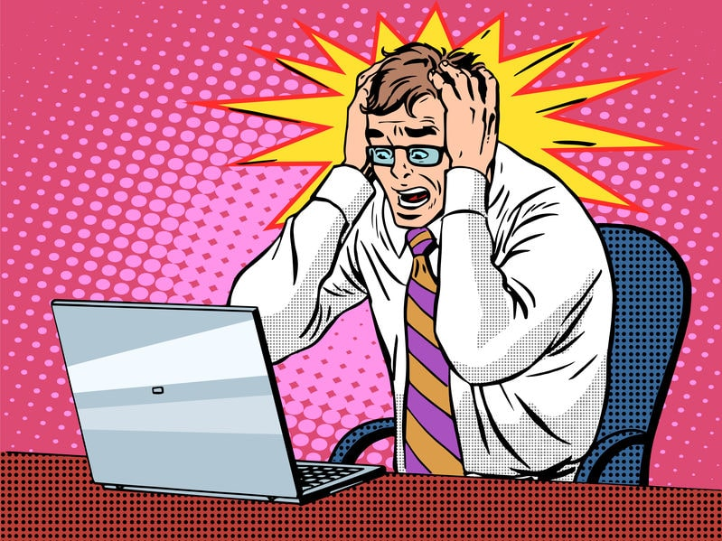
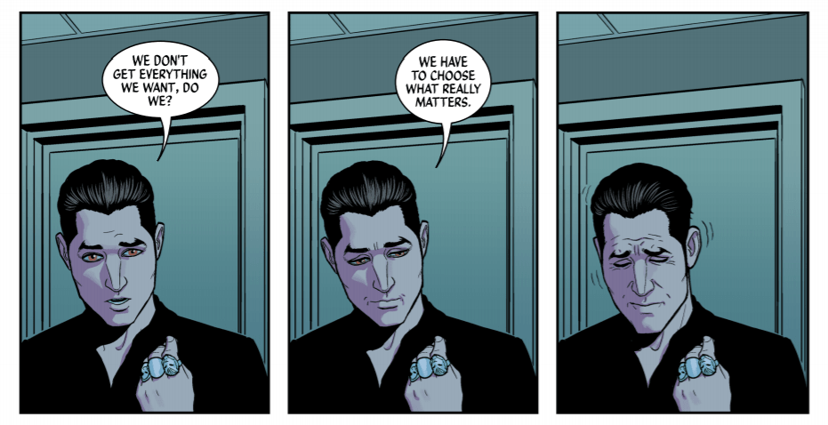
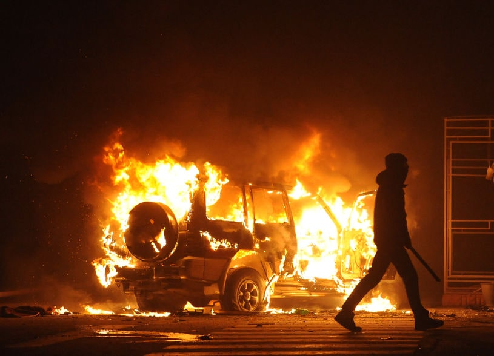
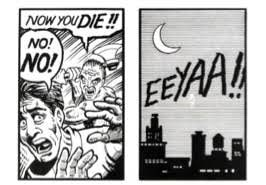
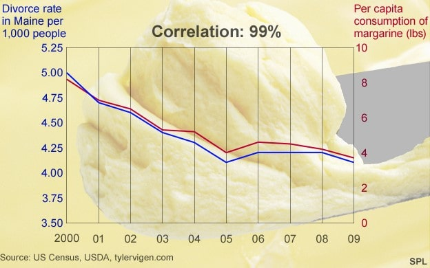

I am a huge fan of comics. I love their glossy pages, their bright colours, their weird character designs. I love beautiful comic art, and I love the stories that only comics can tell: stories full of emotional depth and character complexity, or brimming with action and excitement, or set in worlds too strange and fantastic for even the wildest of movie budgets.  

But comics aren’t just fun; they’re also part of a unique medium with its own complex rules and capabilities. Comics are visual stories which depend on powerful images; they pack huge amounts of information into a small space and rely on readers to fill in the blanks. The techniques comics use to tell their stories can move and delight us – but these same techniques can, in other settings, also be used to mislead or manipulate us.

** **The Wicked + The Divine. Written by Kieron Gillen, line art by Jamie McKelvie, colours by Matt Wilson.*

These three panels from *The Wicked + The Divine*, an Eisner-award-nominated comic series which ran from 2014-2019, demonstrate the power of images to convey information. The panels convey not only factual information – telling us where we are and who is speaking – but emotional information as well. The sharp angles and minimalist lines of the background create a feeling of harshness and emptiness; the colour palette of washed-out greys, blacks, and blues suggest both sadness and sterility. And, of course, there are the facial expressions and body language of our speaking character, Cameron, which are amplified and emphasised by the way he dominates each panel. These images form a vivid picture of his internal landscape, and his shift from surety to wry resignation and, finally, to a quiet breakdown.

Even without reading the speech bubbles, and without knowing the wider context of this scene, we can read a whole story out of these three panels: a story about a single character’s anguished resolve in the face of limited options; a story which emphasises the importance of that character’s emotional journey and asks us to sympathise with him. These images, despite their apparent simplicity, pack a lot of complex information into a small space; they are able to convey facts, feelings, and even a whole worldview. 

What does this have to do with misinformation? Well, while most writing about information literacy focuses on written content, the powerful use of visual information in comics reminds us that images, even those that seem simple or innocuous, can make us think and feel things too. Pictures don’t have to outright lie to mislead us: even a genuine, authentic image, like an unedited photograph, can mislead us by suggesting untrue ideas and conclusions, or by making us feel emotions – like fear and outrage – that cloud our judgment. Graphic images of violence or destruction, for instance, often make us react strongly and emotionally, and thus create powerful and immediate reactions which might not take into account the images’ context.

This happens because we all have the instinctive ability to “read” images, but it also happens because of a technique called “closure”. The term was coined by Scott McCloud in his book *Understanding Comics*, and it refers to a reader’s ability to fill in the gaps between two images, or between two pieces of information, that are placed side by side.

 
 Panels from *Understanding Comics* by Scott McCloud.

In this example from *Understanding Comics*, we see two images: one of a man being chased by an attacker with an axe, and one of a city skyline with a scream written over it. A reader looking at these images easily and naturally draws certain conclusions: that the scream in the second image belongs to the attacked man in the first, and therefore that he has been caught by his attacker and hurt, or even killed, with the axe. Yet these conclusions are never stated to us – we never *see* the man getting attacked. They are simply *suggested* by the way these pieces of information are placed. Our brains have filled in the gaps, and created the story, on their own. 

 *Eating margarine… causes divorce?* [[Source](https://www.bbc.com/news/magazine-27537142)]

Closure is often exploited by creators of misinformation to suggest certain relationships between events or pieces of information which may not exist in reality. For instance, a misleading news article may present unrelated statistics side by side, making us believe that one thing has caused or affected the other. Or a website might publish a headline, like “my cancer miraculously went away!”, alongside an unrelated image, like a picture of a bag of rice. The way such information is placed might lead us to a conclusion – in this case, that rice cures cancer – that is untrue and, if stated outright, might even sound unbelievable. 

Comics show us the power of images, and of our own minds, to create whole stories around small pieces of carefully-placed information. In doing so, they show us how this very power can be used against us. As if we needed more reasons to think critically about the stories we read – or more reasons to think comic books are cool!

 *This article was written by Kimberley Chiu.*  

*Kimberley is the Associate Librarian in charge of the adult collection at Ang Mo Kio Public Library. She likes cats, books, and coffee, and spends most of her free time reading fanfiction and watching overlong videos on YouTube. She co-hosts a podcast on film adaptations, and is currently working on a novel.*

**References:**

[https://theconversation.com/out-of-context-photos-are-a-powerful-low-tech-form-of-misinformation-129959](https://theconversation.com/out-of-context-photos-are-a-powerful-low-tech-form-of-misinformation-129959)

[https://www.bbc.com/news/magazine-27537142](https://www.bbc.com/news/magazine-27537142)

[http://www.tylervigen.com/spurious-correlations](http://www.tylervigen.com/spurious-correlations)

[https://time.com/3605606/ferguson-in-defense-of-rioting/](https://time.com/3605606/ferguson-in-defense-of-rioting/)

*The Wicked + The Divine*, by Kieron Gillen and Jamie McKelvie. Image Comics, 2019.

*Understanding Comics: The Invisible Art*, by Scott McCloud. Tundra Publishing, 1993. 

 