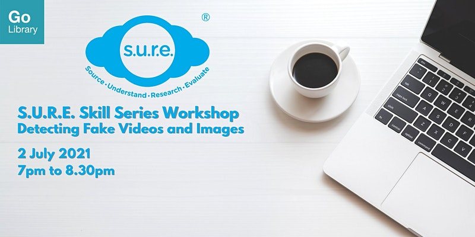

Learn more about the rising threat of manipulated images & deepfake videos used in fake news, and how to detect them with online tools.

Date: Fri, 2 July 2021  Time: 7:00pm to 8:30 PM Conducted via Zoom Free of Charge

REGISTER **[HERE](https://www.eventbrite.sg/e/detecting-fake-videos-and-images-sure-skills-series-x-my-digital-life-registration-159064751955)**

## About this event

**Important Notice**

This programme/event is open to members of the National Library Board, Singapore. Please ensure you have your myLibrary ID on hand before proceeding with the registration. If you do not have a myLibrary ID, you can create one here: [https://account.nlb.gov.sg/](https://account.nlb.gov.sg/).

**About the Programme/Event**

In this workshop, participants will learn about the rising threat of manipulated images and deepfake videos which are disseminated via social media and messaging apps. This interactive session will also equip participants with the skills to detect fake images and videos using online tools.

This workshop is the first of three in the *S.U.R.E. Skill Series* *Workshops*:

- [Part 1: Detecting Fake Videos and Images (2 July 2021, 7pm – 8.30pm)](https://www.eventbrite.sg/e/detecting-fake-videos-and-images-sure-skills-series-x-my-digital-life-registration-159064751955)
- Part 2: Safeguarding Your Mind Against Fake News (3 September 2021, 7pm – 8.30pm)
- Part 3: Be a Smart Factchecker (3 December 2021, 7pm – 8.30 pm)

S.U.R.E. stands for Source, Understand, Research and Evaluate, and is an initiative of the National Library to educate the public on information literacy. For more information and free resources, please visit us at [sure.nlb.gov.sg](https://sure.nlb.gov.sg/)

**About the Speaker**

Mervin is a versatile trainer and facilitator with over six years of training experience in the National Library’s Outreach team. He has conducted numerous talks and workshops on information literacy, library databases and combating fake news to diverse audiences, and have trained over 40,000 individuals.

