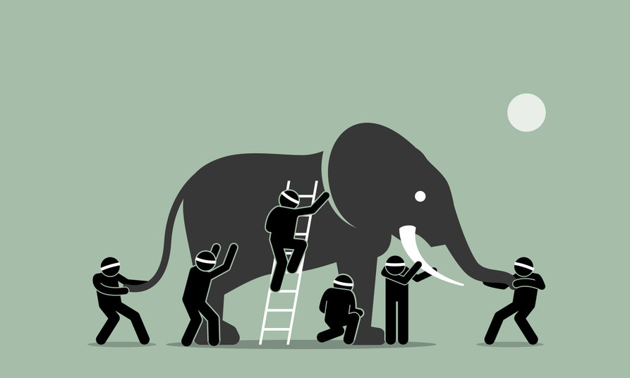

It took me a long time to learn to read, when I was a child, but once I did, I read *everything*: menus, manuals, advertisements. I’d follow my parents to the supermarket and hover in front of the freezers, reading the words on the chicken nugget boxes. I used to go everywhere with a book wedged under my little arm, sometimes two: joke books, trivia books; books about science and maths and history. And, of course, my favourites: all those books of fiction, the chapter books and short novels and anthologies. The storybooks.

I read less and less non-fiction as I grew older, and by the time I was a teenager I was reading fiction almost exclusively. My mother, who loves facts, found this very distressing. 

“You love reading so much,” she used to say, “why don’t you read something informative? Like a biography, or the encyclopaedia?”

“Because they’re boring,” I would reply. “I don’t like reading *information*. I like reading *stories*.”

This carried on for years; in fact, it was only once I started working that I began, slowly, to read non-fiction again. And, as I did so, I started to remember something that I had forgotten a long time ago, something that I had known when I was just a child poring over our new TV’s instruction manual: that, actually, *all* books are storybooks. That all information, all *facts*, are really just stories in disguise.

What do I mean by this? We often believe that there are two kinds of statements about the world: facts, which are objective, verifiable, and neutral; and opinions, which are subjective and therefore somewhat untrustworthy. We also tend to assume that “factual” is the same as “truthful”: that claims that appear to be objective are more likely to be true than those which are clearly based on a particular perspective or interpretation. This is where the idea of bias comes from, and also why so much trust is placed in data – why we tend to believe that numbers, unlike people, cannot lie.

But as any statistician will tell you, numbers *can,* and in fact *do*, lie all the time. This is because numbers cannot actually tell us anything without the aid of human interpretation, and can often support multiple different interpretations at once. Statistics are also extremely susceptible to manipulation, and the choices that statisticians make in choosing what data to collect and include can dramatically change the results they produce: as Kalev Leetaru points out in an article for Forbes, many apparent “truths” drawn from data are, in fact, “factually true statements that utilize such a carefully constructed population sample that their argument is almost meaningless”.

*What colour is this dress? ([Photo source](https://en.wikipedia.org/wiki/The_dress#/media/File:The_dress_blueblackwhitegold.jpg))*

It’s clear that the conclusions we draw from supposedly objective data are often as much a reflection of our perspectives and assumptions as they are of “truth”. This applies to all kinds of data, including everyday observations; when we look up and see that the sky is blue, we are in fact interpreting the raw data our eyes receive about the wavelength of light from the sky. As the 2015 meme surrounding that one blue-and-black – or was it white-and-gold? – dress proved, these interpretations can be more subjective than we expect. As vision scientist Pascal Wallisch writes, “people’s perceived [colour] is also informed by their perception of lighting”, and this in turn is often based on “the viewing history of the individual observer” and the assumptions this history creates. Our past experiences literally change the way we see the world.

The process of turning data into “facts” is, therefore, less a search for truth than an attempt to create meaning: to string bits of information, expectation, and thought together to create a message that makes sense. It is, in other words, an act of storytelling. 

What this means is that there is no such thing as a fully objective statement. It is not actually possible for information to be totally free of bias, since our perceptions of data and of reality are always informed by our beliefs, assumptions, or history. This does not mean that every claim is equally true or trustworthy, or that we can never really trust a “fact” again; it does mean, though, that whenever we encounter these claims, whether in an opinion piece or in a supposedly objective non-fiction book, we must first think about what their underlying assumptions are, and whether we do – or can, or should – agree with these assumptions.

A history book about the reasons for the end of the Cold War assumes, among other things, that the Cold War existed, that it ended, and that it ended for specific reasons that can be known and understood. A book about healthy eating assumes not just that certain foods are good for your body, but also that a certain type of body – typically a thin one – is “good” and “healthy”, while others are not. A book about how to get rich assumes that getting rich is a good thing, that it is possible for anyone to get rich, and that readers will all be able and willing to take the actions the book suggests. 

Each of these books also assumes that the data they use to prove their points is accurate and trustworthy, that their logic holds together, and that the authors themselves, in telling the stories that they tell, are acting in good faith. We can choose to share, agree with, or just accept any or all of these assumptions as we read – but we must be aware that this is something we are doing, and understand why we have chosen to do it.

This choice may sound daunting, but it is one of the things I love most about reading. In choosing not just what books to read, but also which stories to believe and which perspectives to trust, I am able to be in charge of what I know. By recognising the storytelling involved in non-fiction texts, I can read them not as a passive recipient of facts but as an active participant, evaluating each claim for myself and using my own judgment to draw my own conclusions. 

And, in doing so, I catch a glimpse of the wonder I had as a child – the same magic that made me read every word I could see, confident that each and every one of them contained endless stories that I could discover for myself.

*This article was written by Kimberley Chiu.*  

*Kimberley is the Associate Librarian in charge of the adult collection at Ang Mo Kio Public Library. She likes cats, books, and coffee, and spends most of her free time reading fanfiction and watching overlong videos on YouTube. She co-hosts a podcast on film adaptations, and is currently working on a novel.*

**References:**

Kalev Leetaru, “Lies, Damned Lies And Statistics: How Bad Statistics Are Feeding Fake News”. Article in *Forbes*, published 2 February 2017. [https://www.forbes.com/sites/kalevleetaru/2017/02/02/lies-damned-lies-and-statistics-how-bad-statistics-are-feeding-fake-news/?sh=5eb81c7350ca](https://www.forbes.com/sites/kalevleetaru/2017/02/02/lies-damned-lies-and-statistics-how-bad-statistics-are-feeding-fake-news/?sh=5eb81c7350ca), accessed 6/4/21.

Pascal Wallisch, “Two Years Later, We Finally Know Why People Saw “The Dress” Differently”. Article in *Slate*, published 12 April 2017. [https://slate.com/technology/2017/04/heres-why-people-saw-the-dress-differently.html](https://slate.com/technology/2017/04/heres-why-people-saw-the-dress-differently.html), accessed 6/4/21.

 