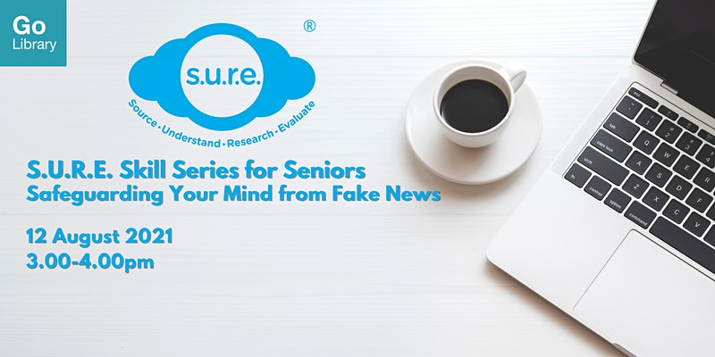

**Learn more about the psychological reasons behind the spread of fake news, and more importantly, what you can do about it.**

Date: 12 August 2021  Time: 3:00pm to 4:00 PM Conducted via Zoom Free of Charge

**DOWNLOAD THE SLIDES [HERE](https://go.gov.sg/nlb-sure-12aug2021-slides).**

## About this event

Fake news can do real harm—destroy trust, damage learning culture, and even intensify social conflict. Why are we susceptible to fake news? How can we help those who unwittingly share them? Find out more about the psychological reasons behind the spread of fake news, and more importantly, what you can do about it. This workshop is Part 1 of the S.U.R.E. Skills Series for Seniors:

- Part 2: Factchecking Dubious Emails & Messages (15 September 2021, 3-4pm)
- Part 3: Verifying Images & Videos (11 November 2021, 3-4pm)
- Part 4: Spotting Deepfake Images & Videos (7 December 2021, 3-4pm)

S.U.R.E. stands for Source, Understand, Research and Evaluate, and is an initiative of the National Library to educate the public on information literacy. For more information and free resources, please visit us at [sure.nlb.gov.sg](https://sure.nlb.gov.sg/).

**About the Speaker**

Jessie Yak has been with the National Library Board for more than 8 years. She believes that information literacy is an important skill in the increasingly technology-driven society, and wishes to reach out and prepare as many citizens as possible to be literate consumers of the information around them.