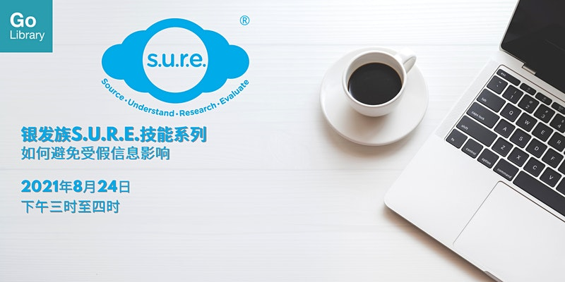

**这个工作坊将能让您了解人们撒播假信息背后的心理因素，以及您能如何协助制止假信息的传播。**

Date: 24 August 2021  Time: 3:00PM to 4:00 PM Conducted via Zoom Free of Charge

**Download the slides [HERE](https://go.gov.sg/nlb-sure-24aug2021-slides).**

## About this event

假信息可以摧毁信任、破坏学习文化，甚至加剧社会冲突。人们为何容易轻信假信息？我们又能如何帮助那些在不知情的情况下散播假信息的人们呢？这个工作坊将能让您了解人们散播假信息背后的心理因素，以及您能如何协助制止假信息的传播。本工作坊是银发族S.U.R.E.技能系列的第一部分。

- 第二部分：如何查证电邮和信息的真伪（2021年9月21日，下午三时至四时）
- 第三部分：如何查证图像和影像的真伪（2021年11月15日，下午三时至四时）
- 第四部分：如何识破 “深度伪造” 图像和影像（2021年12月15日，下午三时至四时）

本活动适合50岁及以上的朋友们参加。

**关于讲员**

叶若诗是国家图书馆的外展服务馆员，专责向公众推广信息素养（Information Literacy）的知识和重要性。