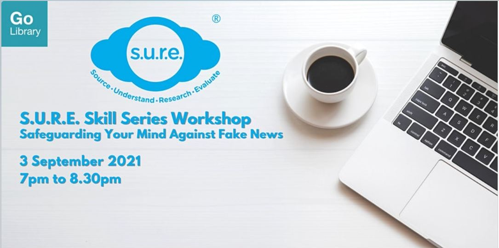

Learn more about the psychological reasons behind the spread of fake news, and more importantly, what YOU can do about it.

Date: Fri, 3 Sep 2021  Time: 7:00pm to 8:30 PM Conducted via Zoom Free of Charge

Download the slides [**HERE**](https://go.gov.sg/nlb-sure-03sep2021-slides).

## About this event

In this interactive workshop, participants will learn about the psychological factors that drive the spread of fake news along with the means of how to safeguard one's mind against the constant exposure to online information, social media and messaging platforms. 

This workshop is the second part of the *S.U.R.E. Skill Series* *Workshops*:

- Part 1: Detecting Fake Videos and Images (2 July 2021, 7 pm – 8.30 pm)
- Part 2: Safeguarding Your Mind Against Fake News (3 September 2021, 7 pm – 8.30 pm)
- Part 3: Be a Smart Factchecker (3 December 2021, 7 pm – 8.30 pm)

S.U.R.E. stands for Source, Understand, Research and Evaluate, and is an initiative of the National Library to educate the public on information literacy. For more information and free resources, please visit us at [sure.nlb.gov.sg](https://sure.nlb.gov.sg/)

**About the Speaker**

Mervin is a versatile trainer and facilitator with over six years of training experience in the National Library’s Outreach team. He has conducted numerous talks and workshops on information literacy, library databases and combating fake news to diverse audiences, and have trained over 40,000 individuals.

