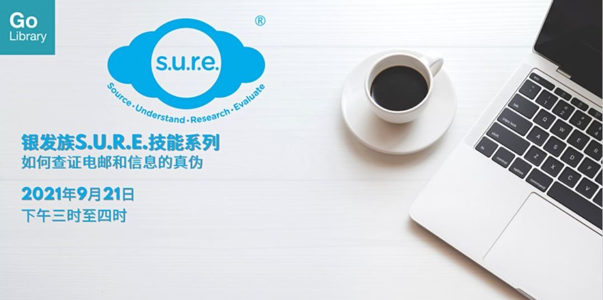

**通过这个工作坊，您能学习怎么查证可疑电邮和信息的内容，便可以像专业人士一样地先查证信息的真伪，再决定要不要分享。**

Date: 21 September 2021  Time: 3:00PM to 4:00 PM Conducted via Zoom Free of Charge

Download the slides **[HERE](https://go.gov.sg/nlb-sure-21sep2021-slides)**.

## About this event

您是否对在社交媒体里层出不穷的假信息感到厌烦？您曾否因在不知情的情况下分享假信息而感到尴尬？通过这个工作坊，您能学习怎么查证可疑电邮和信息的内容，便可以像专业人士一样地先查证信息的真伪，再决定要不要分享。

本工作坊是银发族S.U.R.E.技能系列的第二部分。

- 第三部分：如何查证图像和影像的真伪（2021年11月15日，下午三时至四时）
- 第四部分：如何识破 “深度伪造” 图像和影像（2021年12月15日，下午三时至四时）
- 本活动适合50岁及以上的朋友们参加。

**关于讲员**

叶若诗是国家图书馆的外展服务馆员，专责向公众推广信息素养（Information Literacy）的知识和重要性。