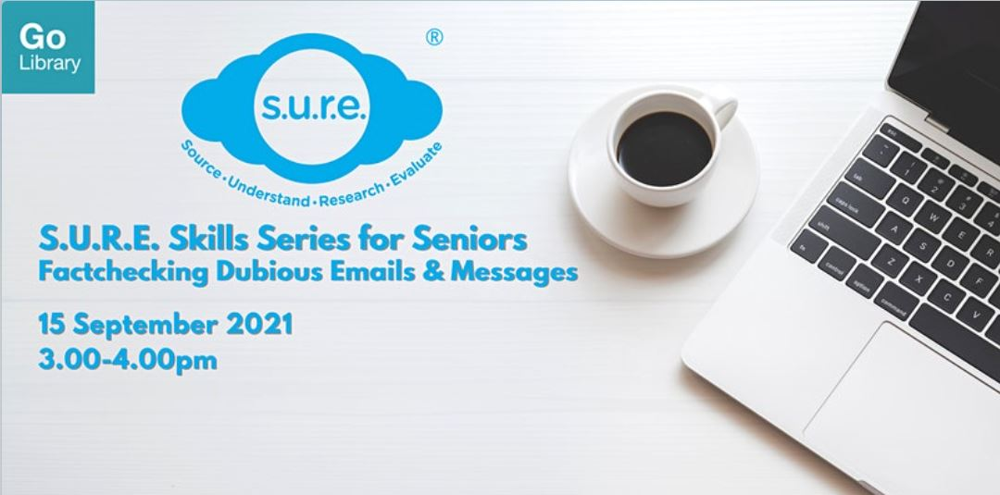

**Hone your skill at spotting fact from fiction - learn how check and confirm like a professional before you share emails and messages**

Date: 15 September 2021  Time: 3:00PM to 4:00 PM Conducted via Zoom Free of Charge

Download the slides **[HERE](https://go.gov.sg/nlb-sure-15sep2021-slides)**.

## About this event

Have you received fake news from your friends or family? While their intentions may be well-meaning, such emails or messages can contain half-truths or even fully fabricated details. Hone your skill at spotting fact from fiction at this interactive workshop—learn how to check and confirm like a professional, before you share your next email or message.

This workshop is Part 2 of the S.U.R.E. Skills Series for Seniors:

- Part 3: Verifying Images & Videos (11 November 2021, 3-4pm)
- Part 4: Spotting Deepfake Images & Videos (7 December 2021, 3-4pm)

This programme is suitable for those aged 50 and above.

S.U.R.E. stands for Source, Understand, Research and Evaluate, and is an initiative of the National Library to educate the public on information literacy. For more information and free resources, please visit us at [sure.nlb.gov.sg](https://sure.nlb.gov.sg/).

**About the Speaker**

Jessie Yak has been with the National Library Board for more than 8 years. She believes that information literacy is an important skill in the increasingly technology-driven society, and wishes to reach out and prepare as many citizens as possible to be literate consumers of the information around them.